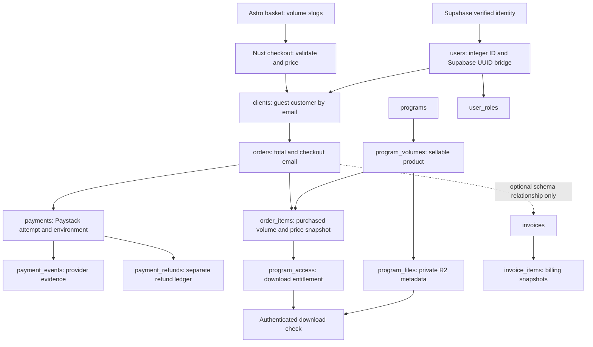

# Paystack production readiness audit

Date: 17 September 2026

Original reviewed revision: `4f1a2247cc51560a5c065ae02cc0ae217a12cd3f`

Remediation update: 17 September 2026 — PAY-01 through PAY-05 implemented and verified locally.
Billing update: 18 September 2026 — BILL-01 implemented locally, including manual/coaching lifecycle, original-preserving reissues and evidence-backed review. DB-01 and DB-02 fixed locally. Rollout/accounting review remains outstanding.

**Recommendation: do not enable live payments yet.** The basic architecture is
sound, but deployment activation and other launch requirements remain unresolved.
Verification, refund matching, checkout retries, environment safety and recovery
now have local fixes and real PostgreSQL tests. Purchase/manual invoicing,
correction/reissue and settlement/refund history are implemented locally; other critical payment
paths still need tests. Passing builds alone do not establish payment correctness.

This audit covers the Astro catalogue, basket, checkout and return page; Nuxt
checkout, webhooks, refunds, customer authentication and downloads; admin
purchase reporting and file lifecycle; Drizzle schemas, relevant migrations,
and deployment workflows. The original audit changed documentation only.
The subsequent remediations change code, tests, and add reviewed forward
migrations as documented below. Deployed settings/data are unchanged; migrations
have been applied only to disposable local test databases.

## Production readiness checklist

Check an item only after its fix and acceptance checks are complete. Checked
findings below are implemented locally; unchecked findings remain open. A checked code
fix means locally verified, not deployed. Detailed evidence, conditions, and
acceptance criteria remain in each finding below.

- [x] **PAY-01 (P1):** Prevent stale verification from overwriting settled payments; validate provider evidence and pass PostgreSQL concurrency tests.
- [x] **PAY-02 (P1):** Match refund API responses and webhooks to one refund; test duplicate and reordered events against refund limits.
- [x] **PAY-03 (P1):** Make checkout retries under the same persistent intent idempotent and prevent duplicate payable orders.
- [x] **PAY-04 (P1, conditional):** Validate Paystack key/mode and URLs; quarantine mixed-mode databases before payment operations and customer entitlement consumption. Deployed resource isolation remains a separate launch gate.
- [x] **PAY-05 (P1):** Add durable payment/refund recovery, controlled replay, operator alerts and dispute/reversal access policy. Deployment, scheduler activation and real-provider validation remain launch gates.
- [x] **BILL-01 (P1):** Implement purchase/manual invoice creation, issue/delivery, evidenced settlement/refunds, original-preserving reissues, financial replacements and legacy review. Deployment, accounting review and actual browser/provider/SES checks remain launch gates.
- [ ] **TEST-01 (P1):** Cover the remaining critical payment/API/browser paths and gate deployment on automated tests. PAY-01's new tests are only partial progress here.
- [x] **WEB-01 (P2):** Preserve basket items during temporary catalogue errors, with retry and fresh-price checks (verified locally).
- [x] **WEB-02 (P2):** Freeze submitted selections, lock local edits and persist pending baskets by reference (verified locally).
- [x] **WEB-03 (P2):** Display partial/full refund and reversal statuses accurately on the return page (verified locally).
- [x] **ACCESS-01 (P2):** Implement post-payment instructions and durable login/email retries locally. Deployment and real-provider rollout remain gated.
- [x] **ACCESS-02 (P2):** Respect entitlement start times and preserve independent overlapping purchase/manual grants (verified locally; migration rollout required).
- [x] **ACCESS-03 (P2):** Protect the final owed file after unpublishing/archiving and across open checkout settlement (verified locally; migration rollout required).
- [x] **DB-01 (P2):** Enforce invoice/order customer consistency with a forward migration and real PostgreSQL tests. Deployed legacy links still require preflight review.
- [x] **DB-02 (P2):** Preserve recorded manual purchase history during profile edits; reject financial rewrites and reserve corrections for a separate workflow (fixed locally).
- [ ] **SEC-01 (P2):** Add shared abuse controls, trusted ingress identity, verification throttling, and email recipient cooldowns.
- [ ] **SEC-02 (P2):** Minimize retained provider data and define a tested retention/access policy.

### Launch validation (separate from code fixes)

- [ ] Run the complete two-volume checkout in an isolated Paystack test environment and verify payment/order/items/access/admin reports.
- [ ] Verify closed-browser fulfillment, repeat login, and unauthorized download denial.
- [ ] Verify partial/full refunds, duplicate/reordered webhooks, and recovery from a missed event.
- [ ] Confirm intended-production migrations, RLS/grants, composite constraints, and refund-overage trigger.
- [ ] Test order-line totals, payment/order currency consistency, and settled snapshot immutability; document and enforce the required database/application boundaries.
- [ ] Confirm production-only secrets, database, private buckets, trusted proxy configuration, and Paystack webhook delivery.
- [ ] Confirm email configuration and actual delivery/retry behavior.
- [ ] Record launch evidence and perform the explicitly authorized go-live smoke test in [deployment.md](../deployment.md).

## Original audit evidence and limits

- `pnpm test:coverage`: **66 existing tests passed**, across 17 files. Admin
  statement coverage was **9.82%**; `server/services/paystack.ts`, payment API
  handlers, customer authentication, and download handlers had **0% coverage**.
- Web statement coverage was **85.71%**, but the configured scope is only
  `src/scripts/**/*.ts`: it does not cover the checkout script embedded in
  `index.astro`, the return page, or browser interactions.
- Two additional, temporary Vitest probes executed the real Paystack service
  with mocked database/provider dependencies. Both reproduced the defects in
  PAY-01 and PAY-02. These were diagnostic reproductions of current behavior,
  not permanent regression tests or PostgreSQL integration tests. The temporary
  test file was removed after execution.
- `pnpm check`, `pnpm build:web`, and `pnpm build:admin` passed using Turborepo
  cache results for the unchanged application sources. The admin build retains
  dependency annotation and bundle/performance warnings.
- `pnpm db:check` passed. This checks migration metadata; it does **not** prove
  migrations are applied to a deployed database, that live RLS/grants match the
  repository, or that concurrent transactions behave correctly.
- No real charges, refunds, customer emails, or production database writes were
  made. Deployed secrets, proxy trust configuration, database contents, bucket
  permissions, and Paystack dashboard settings were not inspected. No browser
  end-to-end payment was performed.
- Provider payload assumptions were checked against the official Paystack
  documentation linked beside the relevant findings.

## How the current records link

1. The basket stores slugs in browser storage. Checkout resolves them to
   published database volumes with ready files, checks displayed prices, and
   calculates an authoritative ZAR total in cents.
2. Email is normalized and used to reuse a `clients` row. Merely entering an
   email does not authenticate a buyer or grant access. Checkout inserts one
   order, one item per volume, and one pending payment.
3. An accepted success event updates the payment/order and grants access in a
   transaction. Individual payments are locked during webhook processing.
4. Customers explicitly request a magic link. Supabase verifies the identity;
   the application links `users.id` to `clients.user_id` and grants the customer
   role. Authenticated downloads check that client's active entitlement and
   issue a five-minute signed URL for the configured private bucket.
5. The admin client list follows `clients -> orders -> order_items`. Catalogue
   reporting counts sold items and distinct buyers using qualifying orders and
   payments. Gross sales and active access are different measures; a refund is
   not a deletion of historical sales. The dashboard filters Paystack revenue
   by configured payment environment.
6. `invoices.order_id` can point to an order, and `invoice_items` can point to
   volumes. **No application flow currently creates, issues, emails, or settles
   these invoices.** There is no implemented payment allocation to invoices.

Relevant source: [checkout and payment service](../../apps/admin/server/services/paystack.ts),
[client reporting](../../apps/admin/server/services/client-management.ts),
[catalogue reporting](../../apps/admin/server/services/program-catalogue.ts),
[sales schema](../../packages/db/src/schema/sales.ts),
[access schema](../../packages/db/src/schema/access.ts), and
[invoice schema](../../packages/db/src/schema/invoicing.ts).

## Protections already present

- Zod validation limits baskets to ten unique volumes; quantities are one.
  The server rejects stale prices and calculates its own total.
- Checkout requires an allowed origin, honeypot validation, rate limiting, and
  Turnstile; production fails closed when Turnstile is unconfigured.
- Raw-body HMAC-SHA512 signatures are checked before processing webhooks, with
  a constant-time comparison. This matches
  [Paystack's signature specification](https://paystack.com/docs/payments/webhooks/).
- Successful charges must match the stored reference lookup, amount, currency,
  and payment environment. A browser redirect alone cannot grant access.
- Success processing uses a transaction, payment row lock, and event uniqueness.
  Already fulfilled/refunded payments resist ordinary success replays.
- Refund initiation requires admin authorization and same-origin checks. It
  reserves amounts before the provider request and blocks another unsettled
  refund. A database trigger independently caps non-failed refunds.
- Integer application IDs, integer-cent amounts, and composite ownership
  foreign keys protect order items and purchase entitlements. Application
  tables have RLS enabled in the schema/migrations.
- Authenticated customer queries scope downloads to the linked client, active
  access, ready files, and the configured bucket. Admin uploads require
  authorization and object metadata verification before publication.

These protections should be retained while fixing the findings below.

## Findings and remediation backlog

P1 means fix or resolve the stated launch condition before enabling live
payments. P2 means a concrete correctness, security, or operational issue to
schedule before the affected capability is relied upon. Conditional findings
identify their prerequisites; they are not claims about uninspected production
configuration.

| ID | Priority | Finding |
| --- | --- | --- |
| PAY-01 | P1 — fixed locally | Stale verification can overwrite a successful/refunded payment |
| PAY-02 | P1 — fixed locally | Refund API responses and webhooks do not reliably match the same refund |
| PAY-03 | P1 — fixed locally | Checkout retries create independent payable orders |
| PAY-04 | P1 — fixed locally | Key/mode and URL validation; fail-closed database environment isolation |
| PAY-05 | P1 — fixed locally | Durable recovery, deferred-event replay, alerts and dispute/reversal policy |
| BILL-01 | P1 — fixed locally | Purchase/manual billing, immutable reissues/replacements, settlement/refunds and legacy review implemented; rollout pending |
| TEST-01 | P1 | Critical payment paths lack tests and deployment test gates |
| WEB-01 | P2 | Fixed locally: temporary catalogue errors preserve the basket and require retry |
| WEB-02 | P2 | Fixed locally: submitted snapshots, locked checkout edits and reference-scoped pending baskets |
| WEB-03 | P2 | Fixed locally: explicit payment/refund/reversal messages and support reference |
| ACCESS-01 | P2 | Implemented locally: automatic purchase instructions and durable login/email retries; rollout gated |
| ACCESS-02 | P2 | Fixed locally: shared interval checks and independent grant provenance; migration rollout required |
| ACCESS-03 | P2 | Fixed locally: final-file trigger, serialized checkout guard and atomic replacement; migration rollout required |
| DB-01 | P2 — fixed locally | Composite invoice/order customer FK and PostgreSQL regression test |
| DB-02 | P2 | Fixed locally: profile edits preserve recorded manual purchase history |
| SEC-01 | P2 | Public verification and email abuse controls need strengthening |
| SEC-02 | P2 | Full provider payloads retain unnecessary sensitive payment data |

### PAY-01 — stale verification can overwrite settled state

**Status: completed locally, 17 September 2026.** Not yet deployed.

**Original evidence:** [paystack.ts](../../apps/admin/server/services/paystack.ts), lines
1022–1071, especially 1024–1029 and 1052–1061.

The verifier reads `pending` before awaiting Paystack. Its non-success branch
later updates the payment by ID alone, without locking and rechecking its
current state. A success or refund webhook can commit during that wait. A
stale `failed`/`abandoned` result then overwrites the payment, while the guarded
order update can leave the order `paid` and its access active. Refund totals
can likewise coexist with an incompatible payment status. Terminal responses
also lack the amount/currency/environment/reference validation used by the
success handler.

**Reproduced:** a temporary probe began with a pending payment, simulated a
success webhook while `$fetch` was pending, and returned an older failed
verification. Final state: payment `failed`, order `paid`.

**Fix:** validate the provider result against the requested payment; lock and
reread the payment inside the update transaction, or use a conditional update
and require a returned row before changing related records. Apply explicit,
monotonic transition rules for settled states.

**Acceptance:** deterministic overlapping verification/success/refund tests
plus a real PostgreSQL concurrency test. No stale response may downgrade a
settled payment, change its refund totals, or recreate revoked access.

**Implemented remediation:**

- [x] Validate the successful verification envelope and required transaction fields with a shared Zod contract; require reference, integer-cent amount, currency, and environment to match the stored payment before any write.
- [x] Make non-success writes conditional on `payments.status = 'pending'` inside the transaction and require an updated row before changing orders/access. PostgreSQL rechecks this predicate after waiting on a concurrent update; see [Read Committed behavior](https://www.postgresql.org/docs/current/transaction-iso.html#XACT-READ-COMMITTED).
- [x] Keep success reconciliation on the existing locked, idempotent webhook fulfillment path.
- [x] Add 18 unit tests for invalid/mismatched evidence, already-settled payments, and provider failures.
- [x] Add and run 29 PostgreSQL integration tests using the actual repository migrations: normal verification, repeated success, a matrix of stale responses after success/partial refund/full refund/reversal, an actual uncommitted webhook row-lock overlap, later success after failure, and atomic rollback.

Tests are in [unit tests](../../apps/admin/tests/paystack-verification.test.ts)
and [PostgreSQL tests](../../apps/admin/tests/paystack-verification.integration.test.ts).
See [test instructions](../../apps/admin/tests/README.md) to rerun them. The
integration run used a disposable local PostgreSQL 18 cluster and mocked
provider responses; it did not contact Paystack or test deployed Supabase
authentication/RLS policies. At PAY-01 completion the ordinary suite had
**84 passing tests** and the opt-in database suite had **29 passing tests**.
See PAY-03 below for the latest totals. Broader test coverage and CI
gates remain tracked under TEST-01. `pnpm check`, `pnpm build:admin`, and
`pnpm build:web` also passed after the code change (both production builds ran
uncached). Existing admin dependency annotation and bundle warnings remain.

### PAY-02 — refund identity is inconsistent across response and webhook

**Status: completed locally, 17 September 2026.** Not yet deployed.

**Implemented:** separate unique API-ID and webhook-reference columns; match
known identities with payment/amount/currency checks, or bind an unambiguous
reservation even when its API ID is already saved. Preserve terminal states
when events arrive out of order. Missing, ambiguous, or contradictory evidence
is recorded for review without creating another refund. All paths use the same
payment-first lock order. Historical mixed identifiers are matched conservatively.

Seven added PostgreSQL tests cover partial/full null-reference refunds, numeric
IDs and differing references, webhook-before-response, duplicate/reordered
events, equal partial refunds, ownership conflicts, uncertain requests, and
remaining refund limits. The database suite passed 36 tests. Apply the reviewed
forward migration `20260917143554_concerned_living_mummy.sql` before deploying
this service. It adds a nullable reference and partial unique index without
rewriting historical IDs; unresolved historical refunds still require review.

**Evidence:** [paystack.ts](../../apps/admin/server/services/paystack.ts), lines
617–659, 703–710, and 926–943; the
[refund cap trigger](../../supabase/migrations/20260907093011_spooky_triton.sql),
lines 43–76.

The refund API path stores `data.id` when `refund_reference` is absent. The
webhook path searches by `refund_reference`/`id`, then falls back only to local
refunds whose provider ID is null. Paystack documents a webhook with a null
refund reference and no refund ID, while its creation response includes an ID.
See the [official refund examples](https://paystack.com/docs/payments/refunds/).

After the creation response saves its ID, that documented webhook shape cannot
match the reservation. The service inserts another refund. A small partial
refund can reserve money twice; a full refund will exceed the database cap and
roll back the webhook. The same weakness applies when API IDs and webhook
references are different identifiers.

**Reproduced:** starting with a R100 payment and an existing R30 pending refund
with a saved provider ID, the real handler with mocked database dependencies
inserted a second R30 row for a null-reference pending webhook. The local active
refund sum became R60. The full-refund trigger consequence was established by
SQL inspection, not a live database test.

**Fix:** distinguish provider refund IDs from processor references. Reconcile
against the provider's authoritative refund record and validate payment,
environment, currency, and amount before updating it. Ambiguous webhook
identity must remain pending reconciliation, not cause another reservation.
Handle either webhook/API-response arrival order.

**Acceptance:** fixture tests for null, missing, numeric, and differing
identifiers; API response before/after webhook; two equal partial refunds;
duplicate and reordered events; full refunds. One real refund must map to one
local refund throughout its lifecycle.

### PAY-03 — checkout has no request idempotency or resumable attempt

**Status: completed locally, 17 September 2026.** Not yet deployed.

**Implemented remediation:**

- [x] Require an unpredictable intent token on both single-volume and basket checkout; share request normalization across browser/server and document it in OpenAPI.
- [x] Persist paired key/request hashes on payments with real uniqueness/hash constraints, serialize reservation creation, and reject changed details under an existing key.
- [x] Claim initialization durably before network I/O. Concurrent requests and lost-browser-response retries reuse one order/reference/saved hosted URL. Provider initialization and verification use bounded timeouts with automatic retries disabled.
- [x] Keep ambiguous initialization pending under its existing reference; distinguish explicit rejection, reconcile uncertainty through existing validated verification, and preserve concurrent webhook settlement. Never automatically invent a replacement reference.
- [x] Persist browser keys across retries/reloads and serialize modern cross-tab storage with Web Locks. Validate recovery references and status responses; retire confirmed terminal intents for deliberate later purchases/retries. Use the submitted item snapshot when remembering checkout.
- [x] Add 20 real PostgreSQL checkout cases plus unit/contract/browser-helper tests for purchase identity, validation, unsafe URLs, storage failures, recovery, and status evidence.

**Verification:** 124 ordinary tests and 56 opt-in PostgreSQL tests passed;
lint/type checks, migration checks, and both production builds passed. Provider
responses were fixtures, not real charges. See [checkout-idempotency.md](../checkout-idempotency.md)
for behavior, recovery, limitations, and test/rollout instructions. The reviewed
forward migration is `20260917144154_careful_arachne.sql`; coordinate backend and
frontend deployment because `idempotencyKey` is now required.

**Limits:** idempotency protects the same intent, not all purchases using an
email address. Fresh keys represent deliberate separate purchases. Clearing
browser storage/changing devices loses that browser association; simultaneous
first creation across tabs requires Web Locks. Pending uncertainty never
expires into a fresh payable reference automatically. Independent operator/
provider recovery remains PAY-05, broader CI/browser launch gates remain TEST-01,
and WEB-02's in-flight basket/pending-reference code is now implemented locally;
deployed browser checks remain required.

**Original evidence and acceptance:**

**Evidence:** [paystack.ts](../../apps/admin/server/services/paystack.ts), lines
195–262 and 298–315; [checkout contract](../../packages/contracts/src/checkout.ts).

Every accepted submission generates a new order and payment reference. There
is no checkout-intent/idempotency key, lookup of a previously initialized
attempt, or request fingerprint. A lost initialization response, reload, or
second tab can produce multiple valid Paystack checkout links for the same
intended purchase. Paying both creates two charges; the entitlement uniqueness
constraint only limits access rows, not charges. Disabling one browser button
does not solve retries across requests.

**Fix:** persist an unpredictable checkout-intent key bound to normalized
customer and basket details, with a unique database constraint and a safe
resume/reconcile path. Keep uncertain provider results distinguishable from
confirmed rejection. Permit deliberate later purchases without merging them
into old intents. Add bounded provider timeouts and explicit retry policy.

**Acceptance:** duplicate simultaneous requests and retry after a lost response
reuse the same payable intent. A changed basket cannot reuse its key silently.

### PAY-04 — environment safety depends on unverified configuration

**Remediation status: implemented and verified locally.** The original finding
below is retained as context. Deployed secrets/resources have not been inspected
or changed, and go-live remains blocked by the separate launch checklist.

**Delivered controls:**

- `server/utils/paystack-configuration.ts` validates exact `test`/`live` mode
  and matching secret prefixes before provider actions. Invalid configuration
  returns generic HTTP 503 errors without leaking secrets. Request-time checks
  keep intentionally disabled checkout from preventing unrelated admin startup.
- Checkout validates the configured public-site origin, the exact
  `/checkout/complete` callback on that origin, and the account origin. Deployed
  builds and all live-mode URLs require HTTPS and non-loopback hosts, with no
  credentials/query/fragment. Local test development may use loopback HTTP.
- A shared database guard rejects any Paystack payment with a different or
  unknown environment. It protects checkout/status/verification, webhook and
  refund processing, magic-link eligibility, verified account linking, and
  existing customer sessions. Both program listing and private downloads use
  that guarded customer boundary. Replacement-access lookup cannot run in a
  database containing the opposite mode. Manual payments do not trigger the guard.
- Known Fly deployment names require test mode for development and live mode for
  production. This blocks test purchases from using production private storage
  even in an otherwise uniformly test-mode database. Production payments and
  customer access intentionally remain unavailable under its pre-launch test
  configuration. Non-Fly deployments need an equivalent reviewed mode policy.
- First checkout reservations take a PostgreSQL transaction advisory lock and
  recheck isolation inside the transaction, preventing differently configured
  apps from concurrently introducing test and live payments into an empty DB.

**Deployment consequence:** a database containing test payments cannot simply
be switched to live. Provision isolated production database/auth/private-storage
resources and review any catalogue/customer migration; preserve test financial
history in the test database. Do not relabel or delete test payments to bypass
the check. Mixed/unknown-mode databases are deliberately quarantined, not
silently repaired. This is application enforcement, not proof of deployed
Supabase/bucket permissions or isolation against direct privileged SQL writers.

**Local verification:** `pnpm test` passes 144 ordinary tests (118 admin,
26 web), including 20 configuration cases. The disposable PostgreSQL suite
passes 65 tests, including invalid checkout configuration producing no provider
request or payment reservation, and active test-purchase customers denied
live account linking/session access/verification/webhook/refund operations.
Existing payment concurrency, idempotency, and refund regressions remain covered.
`pnpm check` and `pnpm build:admin` pass. No real provider requests, emails,
deployed database changes, commits, or pushes were performed for PAY-04.

**Evidence:** [paystack.ts](../../apps/admin/server/services/paystack.ts), lines
195–203, 391–437, and 749–754;
[customer linking](../../apps/admin/server/utils/customer-auth.ts), lines 19–29;
[customer file API](../../apps/admin/server/api/customer/files/%5Bid%5D.get.ts);
[deployment guidance](../deployment.md).

Initialization accepts a nonempty secret without checking that `sk_test_` or
`sk_live_` matches `paystackEnvironment`. A live key with the default `test`
setting can create a real charge recorded locally as test; the subsequent
environment check then rejects fulfillment. Callback/account URLs also retain
localhost defaults and have no backend production-host validation.

Separately, test payments grant ordinary `program_access` rows. Login,
entitlement consumption, and replacement-access lookup do not require a
matching payment environment. **If test and production share a database, or
test orders remain in the database promoted to live**, those grants can unlock
production files for the same volume. Separate bucket names do not isolate an
entitlement. Deployment documentation currently permits shared early-stage
database use, so this must be resolved before launch.

**Fix:** fail startup/checkout on inconsistent key, mode, or production URLs.
Require isolated production database/auth/storage configuration and a reviewed
test-data transition, or explicitly model and enforce environment ownership
throughout access and reporting. Never just relabel test payments as live.

**Acceptance:** all key/mode mismatches fail before provider initialization;
test purchases cannot authenticate into or download production entitlements;
production URLs cannot fall back to localhost.

### PAY-05 — no independent recovery or dispute lifecycle

**Remediation status: implemented and verified locally.** Historical evidence
below describes the original gap. See [recovery operations](../paystack-recovery.md)
for the precise policy, rollout, protected endpoints and activation checklist.

**Delivered:**

- Integer-keyed, RLS-enabled `payment_recovery_jobs` and `payment_disputes`,
  with a reviewed forward migration, restrictive payment foreign keys, unique
  external dispute IDs and one versioned/leased recurring job per payment.
- A protected, disabled-by-default external scheduler endpoint and GitHub
  ten-minute workflow that can wake scale-to-zero Fly machines. Matching
  environment-specific scheduler tokens and an operator mailbox are required.
- Bounded provider verification/refund/dispute reads, transaction ownership
  checks, multi-page validation, durable retry/backoff, expired-lease recovery,
  concurrent-worker protection and priority for pending payments/refunds.
  Recovery never initiates a charge/refund or frees an uncertain refund amount
  merely because the provider list is empty.
- Prerequisite-dependent valid refund/dispute events remain `received` and
  can resume after charge fulfillment. Invalid evidence remains failed/auditable,
  with alerts for known payments. Administrator same-origin/role-protected
  queue, enqueue, stored-evidence replay and audited acknowledgement operations
  cannot supply provider payloads or force financial outcomes.
- Durable, minimal-data SES alerts with delivery retries/timeouts, plus scheduler
  failure signalling. Open disputes alert without revoking access. Confirmed
  merchant-accepted disputes or verified reversals revoke that order's access,
  preserving independently purchased access. Reversal state cannot be undone
  by later success/refund events. Dispute debits are tracked separately from
  ordinary refund reservations; unknown bank outcomes require provider review.

**Local evidence:** `pnpm test` passes 170 ordinary tests (144 admin, 26 web);
the disposable PostgreSQL suite passes 84 tests, including 19 new recovery cases.
Coverage includes closed-browser/missed-webhook success, uncertain refunds,
refund-before-charge, timeout backoff/escalation, concurrent workers, expired
leases, dispute/reversal access policy, cross-payment evidence denial, replay,
acknowledgement, pagination overflow and SES failure/retry. API tests cover admin
authorization/origin guard failures, strict input, scheduler capability and
response codes. `pnpm check`, `pnpm db:check`, and both production builds pass.

**Remaining activation/limits:** the migration has been applied only to temporary
test databases. Deployed secrets/resources, provider payloads, SES delivery,
sleeping-machine wake-up and scheduler notifications are unverified. GitHub cron
is best-effort and default-branch-only: independent heartbeat/backlog monitoring,
appropriate throughput and a dispute owner are mandatory launch checks, not
guaranteed by local tests. BILL-01 still owns invoices/credit notes/net accounting;
SEC-02 still owns retention. No real provider request, email, deployment, commit
or push was performed in this task.

**Evidence:** [paystack.ts](../../apps/admin/server/services/paystack.ts), lines
599–615 and 958–1071; [status route](../../apps/admin/server/api/checkout/status.get.ts),
lines 10–19. Repository search found no scheduled payment/refund reconciliation
or admin replay flow.

Verification happens only when a browser polls a payment still marked pending.
If the customer closes the page and webhook delivery never succeeds, payment
and access can remain unresolved. A refund delivered before charge fulfillment
is recorded as failed and acknowledged; the same event key is subsequently
ignored, even if the prerequisite charge has arrived. An uncertain refund can
remain reserved indefinitely without provider reconciliation.

Only charge success and refund events are handled. Dispute events are stored
as ignored, and already successful payments are not periodically reverified.
An adverse dispute/reversal therefore has no implemented accounting/access
policy or alert. Paystack's [webhook documentation](https://paystack.com/docs/payments/webhooks/)
describes finite retries and dispute event types; those cannot replace local
recovery.

**Fix:** add a durable reconciliation job for stale payments and unresolved
refunds, with backoff, alerts, and a controlled replay mechanism. Distinguish
permanently invalid events from events awaiting prerequisite state. Define
dispute outcomes and entitlement policy without treating every opened dispute
as a completed refund.

**Acceptance:** closed-browser success, missed webhook, refund-before-charge,
provider timeout, and adverse dispute scenarios converge to correct records
without direct database editing or duplicate fulfillment.

### BILL-01 — invoices are schema only

**Status: implemented and verified locally, 18 September 2026.** See
[billing lifecycle and rollout](../billing.md). This does not mark deployment,
real financial/email tests or legal/accounting approval as completed.

- [x] Confirm non-VAT sole-proprietor seller details and capture original checkout buyer snapshots.
- [x] Issue one numbered prepaid invoice per Paystack order from immutable lines, with explicit payment linkage and safe concurrent replay.
- [x] Provide private invoice/credit PDFs and shared admin/customer history pages.
- [x] Deliver billing notifications through a durable, versioned SES outbox with test/live recipient isolation and retries.
- [x] Preserve processed refund and reversal credit history without rewriting invoices or double-crediting.
- [x] Add PostgreSQL invoice/client ownership, immutability, settlement/line consistency, credit limits and outbox relationship guards (also DB-01).
- [x] Test invoice lifecycle, route identity/origin/contracts, PDF generation, delivery failures/concurrency and refunded-customer billing access locally.
- [x] Implement controlled non-financial reissues, manual/coaching draft/issue/payment/refund authoring and void/full-credit replacements; preserve all original records.
- [x] Provide evidence-backed legacy snapshot/allocation approval with original-evidence inspection, immutable actor/reason records and fail-closed unresolved overpayments.
- [x] Add durable admin-command idempotency, private edition PDFs/outbox targets, billed manual integrity guards and billing-only login without programme grants.
- [ ] Apply reviewed migrations, activate the worker/SES safely and review actual legacy records in the intended environment.
- [ ] Obtain accounting review and validate actual authenticated browser, Paystack and SES flows before live enablement.

The worker is disabled by default and shares the existing PAY-05 external trigger.
No scheduler move to Fly cron is included. All five billing migrations have been
tested only in disposable local PostgreSQL; deployment, provider/browser checks,
SES delivery and backlog monitoring remain separate rollout gates. Original
evidence below describes the pre-remediation state, not the implemented code.

Manual bank/cash payment and refund commands record administrator-confirmed
evidence; they never move money. Paystack documents reject manual settlement,
refund and void overrides. Partial payments/instalments are deliberately not
supported. Reissues cannot alter amounts, customer ownership or recipient email;
financial manual replacements require a void or fully credited original.
Existing paid manual program purchases can be invoiced without duplicating
orders/payments/access. Confirmed full manual refunds reuse the shared entitlement
boundary, retaining independent paid purchases. Legacy mixed/unresolved payment
histories and conflicting original snapshots remain blocked, not guessed.

Local verification passed: 237 regular tests, 123 isolated PostgreSQL integration
tests (17 new billing-administration regressions), repository lint/type checks,
migration consistency checks and both app production builds. Synthetic original,
reissued and unpaid service PDFs were rendered for visual QA. No deployed
migrations, live provider calls or real customer emails were performed.

**Evidence:** [invoice schema](../../packages/db/src/schema/invoicing.ts);
[admin navigation](../../apps/admin/app/layouts/dashboard.vue), line 13;
[successful payment handler](../../apps/admin/server/services/paystack.ts),
lines 525–585. Repository searches found no invoice service/API or insertion
into `invoices`/`invoiceItems`; the navigation entry is disabled.

A purchase currently creates orders, items, payments, and access, but no
application invoice, invoice PDF, invoice email, paid invoice state, or refund
credit adjustment. The relationship exists in the schema only. A possible
Paystack receipt is not an implemented Tilana invoice lifecycle.

**Fix:** implement idempotent invoice creation from immutable order snapshots,
seller/customer billing snapshots, numbering, private PDF access, delivery,
settlement linkage, and correction/refund history. For multiple payment
attempts, define whether settlement is derived from the order or represented
through explicit allocations. Select and document billing requirements before
claiming this capability is complete.

**Acceptance:** a two-volume payment produces one intended issued/paid invoice
with two correct lines; replay does not duplicate it; changed catalogue prices
do not alter it; partial/full refund adjustments remain traceable.

### TEST-01 — passing tests do not exercise the financial workflow

**Status: fixed locally (2026-09-19).** A required reusable GitHub quality
workflow now runs repository lint/type checks, migration-history validation,
all ordinary Vitest suites and the isolated PostgreSQL financial integration
suite. Both dev and production deployment workflows depend on this gate, so a
failed check, schema test, payment lifecycle regression or client-flow state
test prevents either application from deploying. Pull requests and pushes to
`main` also run the same gate independently of deployment.

The PostgreSQL suite applies the committed forward migrations to a fresh local
database and covers checkout idempotency/concurrency, transactional
fulfilment, signed-event replay, stale verification races, refund identity and
overage protection, customer linking, billing, private-file authorization and
database constraints. The web suite exercises the basket, checkout intent,
selection freeze, return-page polling and recovery behavior. External Paystack,
SES, Supabase and deployed-browser smoke checks intentionally remain launch
validation; CI uses provider fixtures and never contacts production services.
The root `pnpm test:integration` command and test README document the same safe
local entry point. Original evidence below is retained for audit history.

**Evidence:** [admin Vitest configuration](../../apps/admin/vitest.config.ts),
[web Vitest configuration](../../apps/web/vitest.config.ts), existing tests,
and [deployment workflows](../../.github/workflows/).

Current tests cover contracts, signature helpers, extracted policies and
selected wrappers, but not payment initialization, transactional fulfillment,
refund orchestration, customer linking, or actual HTTP/download authorization.
The coverage results above confirm the gap. Both deployment workflows build
without running `pnpm test`; there is no separate test workflow in this revision.

**Fix:** add service/route tests with realistic provider fixtures, PostgreSQL
integration tests for locks/constraints/rollback, and browser tests for the
basket-to-return-page flow. Gate deployments on tests and checks; do not mask
untested financial behavior behind an aggregate coverage percentage.

**Acceptance:** the cases specified throughout this audit run in CI, including
the two reproduced defects, unauthorized access, webhook replay, refund
overages, and concurrent operations. A failing financial test blocks deployment.

### WEB-01 — transient HTTP failures erase the basket

**Status: fixed locally (2026-09-18).** Checkout uses the focused
`apps/web/src/scripts/basket-catalogue.ts` utility to distinguish available,
definitively unavailable and retryable results. Network failures, ten-second
timeouts, 429/5xx/other uncertain HTTP responses, malformed/proxy bodies and
mismatched slugs preserve every stored selection. Even confirmed unavailable
items are not removed until all selections have been checked successfully.
Only a validated unavailable volume or this endpoint's explicit JSON 404
(`Program volume not found.`) may remove an item.

The page clears its in-memory payable selection while loading and shows an
accessible retry state explaining that selections are saved and current prices
could not be confirmed. It does not allow checkout of a partially loaded basket.
Every catalogue refresh, including the existing HTTP 409 price-conflict reload,
uses `cache: 'no-store'` and a fresh `checkoutRefresh` query key to avoid existing
browser/shared cache entries. Deployed proxies must retain query keys; the server
still validates authoritative prices at checkout. Checkout intent/reference
storage is not reset by catalogue errors. WEB-02's in-flight edit/cross-tab work
is implemented separately below.

Verification passed: 18 new Vitest regression cases covering one/all failures,
HTML/invalid JSON, timeouts, unavailable evidence, mixed uncertain/unavailable
responses, recovery with new prices, cache keys and unchanged intent storage.
`pnpm test` passed (222 admin + 44 web), `pnpm check`, web production build and
`git diff --check` passed. No migrations or backend financial behavior changed.
Actual browser fault-injection and deployed proxy-cache checks remain rollout
evidence, not claimed as completed. Original evidence below is retained.

**Evidence:** [checkout page](../../apps/web/src/pages/checkout/index.astro),
lines 172–205.

`fetchVolume` returns null for every non-OK response or invalid response body,
including a temporary 500/503 or proxy HTML response. `loadBasket` writes only
the surviving volumes back to local storage. A temporary backend failure can
therefore permanently empty a customer's basket and incorrectly claim the
programs are no longer available.

**Fix/acceptance:** distinguish definitive unavailability from retryable
failure. Preserve selections on timeout, 429, 5xx, or malformed responses;
display a retry state. Test one failing item and all failing items. A stale
price reload must also bypass stale catalogue caches or explain that a fresh
price could not yet be retrieved.

### WEB-02 — the displayed basket can change during initialization

**Status: fixed locally (2026-09-18).** A focused checkout-selection guard freezes
the reviewed slugs synchronously before initialization, checks current storage
before submission and rejects reentrant attempts. The grid becomes inert,
blocking local remove/customer-field/navigation edits while retaining its
displayed selection. An external live region announces submission and cross-tab
changes. Successful and recovery responses persist the same frozen snapshot.

Idle storage events reload the basket; in-flight events cannot change the
submitted selection. Failed attempts unlock and refresh changed storage.
Catalogue load versions and a current-selection predicate discard obsolete
responses before they can write stale basket contents. Query shortcut additions
are consumed once, not re-added on every retry after removal.

Separate per-reference pending keys prevent parallel checkouts from overwriting
each other. Conflicting reference selections and persistence failure stop
redirect, preserving the existing intent/reference for recovery. Paid completion
clears only its reference's selections, retains unrelated records, and supports
the prior single-reference format. Web Locks serialize concurrent paid cleanups
where supported; older browsers have best-effort shared basket cleanup, not a
transactional local-storage ledger. Ordinary edits elsewhere cannot alter the
server's submitted order. See [consistency limits](../checkout-idempotency.md).

Regression tests cover frozen delayed-response snapshots, guarded reentry,
cross-tab changes, inert lock/unlock, obsolete refreshes, reference persistence,
reload-style reads, out-of-order/concurrent paid cleanup, legacy records,
malformed storage and persistence failure. Actual deployed multi-tab browser
and Paystack smoke checks remain launch evidence, not claimed as completed.
Original finding and acceptance below are retained for traceability.

Verification passed: `pnpm test` (222 admin + 57 web tests, including 13 new
regression cases), `pnpm check`, the web production build and `git diff --check`.
No backend or schema changes were needed. No provider/database writes, commits
or deployment were performed.

**Evidence:** [checkout page](../../apps/web/src/pages/checkout/index.astro),
lines 149–156, 217–241, and 260; [basket storage](../../apps/web/src/scripts/basket.ts).

Submitting disables only the payment button. Remove buttons remain usable
while the request is in flight. The request contains the original selection,
but the pending-basket record uses mutable `selectedVolumes` after the response.
For example, submit A+B, remove B while waiting, then get redirected to pay for
A+B while the page had changed to A. Only one pending reference is stored, so
parallel tabs can also overwrite one another's cleanup state. Checkout does
not reconcile cross-tab storage changes before submitting.

**Fix/acceptance:** freeze a submitted basket snapshot, lock basket edits during
initialization, guard reentrant submission, and persist pending selections by
reference. Test delayed responses, remove clicks, reload, and parallel tabs.
The selection shown for payment and later cleared must match the submitted one.

### WEB-03 — return-page messages misrepresent refunds

**Status: fixed locally (2026-09-18).** A focused, tested completion utility maps
every contracted status explicitly. Partial refunds retain the purchase-email
sign-in link and successful basket cleanup. Full refunds and reversals explain
that access from this order was removed, without claiming other valid purchases
were revoked. Failed and abandoned checkouts have separate messages and support
guidance. The payment reference is displayed using text content (never HTML),
including during delayed confirmation, with missing/invalid reference handling.

The return page still trusts only successful HTTP responses validated by the
shared status contract. Bounded, uncached polling retries pending, network,
HTTP and malformed-response failures; uncertain evidence neither reports a
failed payment nor retires its reserved intent. Browser callbacks do not grant
access or change the financial ledger. Real provider/browser refund smoke checks
remain rollout evidence, not claimed as completed. Original finding follows.

Verification passed: `pnpm test` (222 admin + 74 web tests, including 17 new
completion regression cases), `pnpm check`, the web production build and
`git diff --check`. Tests cover all statuses, revisited refund callbacks, delayed
confirmation, invalid evidence, cleanup decisions and bounded retry exhaustion.
No backend/schema changes, commits, deployment or real payment/email writes.

**Evidence:** [return page](../../apps/web/src/pages/checkout/complete.astro),
lines 43–57; [status contract](../../packages/contracts/src/checkout.ts).

Every non-pending status except `succeeded` is shown as “No successful payment
was recorded.” A previously successful but partially refunded payment is
therefore presented as unpaid and loses the program-access link. Fully refunded
and reversed payments also get an inaccurate payment-failure message. The
processing fallback asks the user to provide a reference without displaying it.

**Fix/acceptance:** render each supported payment status explicitly, preserving
access guidance for partial refunds and offering clear refund/support details.
Check HTTP and response-schema validity, show the payment reference, and test
revisiting the callback after partial/full refunds and a delayed confirmation.

### ACCESS-01 — payment does not automatically send access instructions

**Status: implemented locally (2026-09-18).** Fulfillment now atomically queues
one purchase notification per order. Branded instructions link to sign-in,
not an expiring bearer token. Login requests queue and try immediately; failed
deliveries remain retryable. An RLS-enabled integer outbox, order/client FK,
unique keys, versioned leases, capped backoff, eligibility rechecks, stale-login
expiry and required safe test recipient protect delivery. Live never redirects.
The protected scheduler runs the disabled-by-default worker and signals failures
with HTTP 503. Tokens are freshly generated, not stored/logged. Delivery remains
at least once, not exactly once. See [delivery operations](../customer-access-delivery.md).

Regression tests cover closed-browser success/replay, concurrent workers,
failed SES/Auth followed by retry, refund cancellation, request coalescing,
expiry, ownership FK, safe recipients and public route guards/privacy. Real
SES/Supabase/browser checks, forward deployed migrations, activation and
independent backlog/heartbeat monitoring remain launch requirements. Historical
finding and acceptance criteria below are retained for traceability.

Verification passed: `pnpm test` (222 admin + 26 web tests), disposable
PostgreSQL integration suite (131 tests, including eight new delivery cases),
`pnpm check`, `pnpm db:check`, admin production build and `git diff --check`.
No real provider calls, deployed database writes, commits or deployments.

**Evidence:** [charge fulfillment](../../apps/admin/server/services/paystack.ts),
lines 578–584; [magic-link route](../../apps/admin/server/api/customer/auth/magic-link.post.ts),
lines 28–56; [email service](../../apps/admin/server/services/customer-access-emails.ts).

The application sends an access email only after the customer requests it on
the sign-in page. No receipt/access notification is queued by payment success.
A buyer who closes Paystack before returning receives no application-generated
next-step email. Requested email delivery failures are logged and the API
returns the same generic response, with no durable retry. The generic response
is appropriate for privacy, but needs operational recovery behind it.

**Fix/acceptance:** create a durable, idempotent post-payment notification job
within the fulfillment transaction and deliver after commit with retry and
monitoring. Explain the intended login flow. Test closed-browser purchases,
duplicate webhooks, provider email failure, and later successful retry.

### ACCESS-02 — overlapping and future access grants are not fully enforced

**Status: fixed locally (2026-09-18).** The shared server entitlement predicate
requires active status, inclusive start and exclusive expiry. Customer listing,
private downloads and admin active-customer reporting use it. Listings combine
overlapping grants into one volume card with unique files.

Each purchased order item now gets its own permanent grant rather than borrowing
an active promotion/manual grant. The unique order-item/composite ownership
constraints remain; single-active client/volume uniqueness is removed by forward
migration `20260918075403_superb_paper_doll.sql`. Full refunds/reversals revoke
only that order's grants, without resurrecting replacements. Other valid grants
remain independent. Partial refunds retain purchase access. Replays cannot
reactivate an explicitly revoked/expired grant.

The migration repairs only missing grants for paid orders backed by matching
settled Paystack evidence and consistent line subtotals, preserving existing
revocations, promotions and manual grants. Review inconsistent/manual history
separately. Pause writers and migrate before deploying the new API; old code
must not remain serving financial/access writes. See
[entitlement rules and rollout](../program-entitlements.md).

Route regression tests cover linked authorization, ownership/time predicates,
private-file constraints and signing, plus duplicate-card/file handling. Real
PostgreSQL regressions cover temporary/future grants, interval boundaries,
concurrent same-volume purchases/refunds, partial refunds, idempotency,
non-resurrection and composite ownership. The suite also replays the actual
repair SQL against old-index fixtures, including unconfirmed/mismatched payment
exclusions and preserved revocations. Verification passed: `pnpm test` (229
admin + 74 web), all 138 disposable PostgreSQL integration tests, `pnpm check`,
`pnpm db:check`, the admin production build and `git diff --check`.
No deployed migration, real provider/email writes, commit or deployment
was performed. Original finding below is retained for traceability.

**Evidence:** [access schema](../../packages/db/src/schema/access.ts), lines
26–40; [ensureAccessForItem](../../apps/admin/server/services/paystack.ts),
lines 391–425; [customer listing](../../apps/admin/server/api/customer/programs.get.ts)
and [download handler](../../apps/admin/server/api/customer/files/%5Bid%5D.get.ts).

The schema supports future `starts_at`, but listing/download checks only status
and expiry. A scheduled grant can be used early if such a row is created.
Also, fulfillment returns immediately when any current active grant exists.
If that grant is an expiring promotion, a paid purchase does not replace it
with the non-expiring purchase access normally created by checkout. After the
promotion expires, the paid buyer can lose access. The unique active
client/volume row makes provenance and overlapping grants especially important.

**Fix/acceptance:** enforce start and expiry consistently; define how multiple
independent grants combine without losing purchase provenance. Test a purchase
during temporary promotional access, future grants, and refunding one of two
paid orders for the same volume, including concurrent events.

### ACCESS-03 — archived programs can lose files for existing buyers

**Status: fixed locally (2026-09-19).** Final-file protection now depends on
delivery obligations, never publication status. Active/unexpired (including
future-starting) grants and open or settled Paystack purchases retain a ready
private file. Checkout takes a volume key-share lock before file validation and
reservation; withdrawal locks the same volume before checking obligations.

The service returns a clear conflict for the final owed PDF. A database trigger
also rejects bypass updates/deletes. Archived programs can receive private
maintenance uploads, and replacement makes the new verified PDF ready before
retiring the old one in the same transaction. There is no unaudited override:
use atomic replacement, or complete the established refund/reversal and grant
revocation/expiry process. See [rules and rollout](../program-delivery-protection.md).

Disposable PostgreSQL regressions cover archive then deactivate, open checkout,
payment settlement after unpublishing, active/future grants, atomic replacement,
sibling files, expired/cancelled release, audit events and direct trigger
enforcement. Verification passed: `pnpm test` (229 admin + 74 web), all 144
disposable PostgreSQL integration tests, `pnpm check`, `pnpm db:check`, the
admin production build and `git diff --check`. No migration, deployment or real
Paystack/SES/R2 operation was performed. Actual deployed browser/Paystack/R2
evidence remains a launch gate.
Original evidence and acceptance follow for traceability.

**Evidence:** [file deactivation](../../apps/admin/server/services/program-storage.ts),
lines 476–505; [publication guard](../../apps/admin/server/services/program-catalogue.ts),
lines 149–163; customer listing/download handlers.

The last-file guard protects published programs only. Unpublish/archive a
program, then deactivate its final file: the operation succeeds despite active
paid entitlements. Those customers retain access records but have nothing to
download. Disabling new sales should not silently withdraw previously sold
content. A similar window exists if content is withdrawn after checkout
initialization but before payment succeeds.

**Fix/acceptance:** protect delivery for existing entitlements independently
of publication state; require an atomic replacement or an explicit audited
withdrawal/refund process. Test archive followed by last-file deactivation and
payment completion after unpublishing.

### DB-01 — invoices can refer to another customer's order

**Status: fixed locally, 18 September 2026.** Billing migration
`20260917155837_polite_shockwave.sql` adds `invoices_order_client_fk`, preserving
nullable order links and preventing an invoice from belonging to a different
client than its order. Real PostgreSQL regression tests prove rejection; billing
also validates settlement currency/amount and invoice line totals. No deployed
migration was applied. Preflight inconsistent legacy rows before rollout.
Original evidence below describes the previous schema.

**Evidence:** [invoicing.ts](../../packages/db/src/schema/invoicing.ts), lines
15–16; [integer-key migration](../../supabase/migrations/20260906182814_slim_moon_knight.sql),
lines 253–254.

`invoices.client_id` and `invoices.order_id` have independent foreign keys.
Unlike order items, no composite constraint requires the order to belong to
the same client. The database permits an invoice for client A linked to client
B's order. There is no current public invoice write path, so this is a schema
gap to close before implementing billing, not a demonstrated public exploit.

**Fix/acceptance:** add a reviewed forward migration enforcing order/client
consistency while preserving the intended optional-order behavior. Reject a
cross-client invoice in a database integration test. Validate invoice currency,
line totals, and settlement allocations against the intended order model.

### DB-02 — paid manual-order edits destroy historical records

**Status: fixed locally, 18 September 2026.** The manual editor now locks the
client/order and returns after profile updates for recorded purchases, without
touching order timestamps, items, payments, entitlements or invoice links.
Financial changes are rejected before any profile update. Only pending manual
reservations with no paid timestamp, payment attempts or invoices can be
replaced/settled. Failed attempts and draft invoices also protect history.
Paid purchase fields are read-only in the admin form; server checks remain
authoritative. PostgreSQL regressions cover repeated profile edits, atomic
rejection, pending settlement, failed attempts, invoice links and concurrent
settlement. No migration is required for this fix. Controlled financial
correction authoring is now implemented under BILL-01. Original evidence
below describes the pre-fix behavior.

Local verification: 217 regular tests and 106 isolated PostgreSQL integration
tests passed, including eight new manual-history regressions. Repository
lint/type checks and the admin production build passed. No deployed data was
changed; browser interaction and deployment checks remain rollout work.

**Evidence:** [updateManualClient](../../apps/admin/server/services/client-management.ts),
lines 234–308.

The edit guard excludes web orders and clients with multiple orders, but still
allows an already paid manual order. Editing that client deletes its access
rows, payments, and order items, then recreates them with a new paid timestamp.
Even an ordinary profile change can rewrite financial history and future
invoice links. This does not currently delete Paystack web orders, but conflicts
with the repository's immutable purchase-snapshot requirement.

**Fix/acceptance:** separate profile editing from financial correction. Make
settled order items/payments immutable; use explicit adjustments with an audit
trail. Test a profile-only edit of a paid manual customer and confirm original
item IDs, prices, payment IDs, and paid time remain intact.

### SEC-01 — verification and email abuse controls are incomplete

**Status: fixed locally (2026-09-19).** Public checkout, contact, newsletter,
sign-in and status traffic now use atomic PostgreSQL counters rather than
process-local maps, so restarts and multiple Fly instances share the same
limits. Bucket identities are HMAC pseudonyms, expired rows are removed after a
short retention window, and RLS plus explicit grants keep the table server-only.
The customer sign-in path also claims a one-minute per-recipient delivery
allowance without changing its enumeration-safe response.

Checkout status requests have a per-IP limit and only one caller may claim a
provider verification for a reference in each 15-second window. The atomic
claim suppresses parallel cross-instance provider calls while webhook and
scheduled reconciliation remain authoritative recovery paths. Public request
identity no longer accepts `x-forwarded-for` or `cf-connecting-ip`; production
requires the explicitly configured `fly-client-ip` header written by Fly Proxy,
and missing/invalid identities fail closed. PostgreSQL tests cover parallel
claims, cooldown expiry and pseudonymization; unit tests cover direct-origin
spoofing and recipient suppression. Original evidence below is retained.

**Evidence:** [status route](../../apps/admin/server/api/checkout/status.get.ts),
lines 4–20; [contact security](../../apps/admin/server/utils/contact-security.ts),
lines 15 and 53–99; [auth security](../../apps/admin/server/utils/auth-security.ts),
lines 4–44; [magic-link route](../../apps/admin/server/api/customer/auth/magic-link.post.ts).

Every public poll of a known pending reference can trigger an external verify
request. There is no per-reference cooldown, request coalescing, or status-route
rate limit. An allowed Origin header is not authentication for non-browser
callers. Someone can repeatedly poll their own pending payment and consume
provider/backend capacity.

Checkout and sign-in limiters are process-local, reset on restart, and do not
coordinate across instances. Client IP selection trusts forwarded headers;
checkout prefers `cf-connecting-ip`. Their reliability depends on the actual
trusted proxy chain and blocking/spoof protection on direct backend access,
which was not verified. The auth map also lacks eviction, and magic-link
delivery has no per-recipient cooldown.

**Fix/acceptance:** use a bounded shared limiter, trusted ingress identity,
per-reference verification throttling/coalescing, and recipient cooldowns.
Test direct-origin spoofing, parallel requests, instance changes, and retry
behavior without preventing legitimate callback recovery.

### SEC-02 — raw payment events retain more data than needed

**Evidence:** [event insertion](../../apps/admin/server/services/paystack.ts),
lines 983–991; [payment event schema](../../packages/db/src/schema/sales.ts),
lines 167–195.

The entire signed webhook or verification response is persisted as JSON.
Paystack's [verification response](https://paystack.com/docs/payments/verify-payments/)
can contain customer details and a reusable payment authorization code. This
one-off purchase flow does not need to retain that authorization. No event
redaction or retention policy is implemented. RLS reduces direct exposure but
does not minimize sensitive data in privileged access and backups.

**Fix/acceptance:** verify signatures against the untouched raw request first,
then persist an allowlisted audit record and digest. If full payload retention
is required, define access restrictions, encryption, and a retention policy.
Test that authorization credentials and unnecessary customer data are absent
from ordinary event records/logs while reconciliation evidence remains usable.

## Database assessment beyond the findings

The main ownership chain is appropriate: guest clients are distinct from
authenticated users; volumes are sellable units; order lines snapshot prices;
payments are attempts; refunds are independent records; access is checked
separately from payment UI state. Composite order/item/client/volume foreign
keys are valuable safeguards.

However, the schema's ability to hold several payments per order is not an
implemented retry workflow: current checkout always creates a new order. Before
adding retries to an existing order, fulfillment/refund logic must consider all
its payment attempts rather than allowing one attempt to overwrite the entire
order's state.

Some documented invariants are application conventions rather than database
guarantees. In particular, there is no aggregate constraint tying the sum of
order items to the order subtotal, no payment/order currency constraint, and
no general database protection against modifying settled snapshot fields.
The current checkout writes consistent values transactionally; new import,
manual correction, and invoice flows must preserve them. Add database tests
and choose constraints/triggers where needed instead of assuming that RLS or
individual nonnegative-amount checks enforce these relationships.

## Suggested implementation order and launch evidence

1. PAY-01/PAY-02 are fixed locally with permanent PostgreSQL regression tests;
   apply their migrations and verify deployed behavior during coordinated rollout.
2. PAY-03 intent idempotency and PAY-05 independent recovery are implemented
   locally. Roll out reviewed migrations and activate/test the external worker
   using [recovery operations](../paystack-recovery.md).
3. PAY-04 code checks are implemented locally. Verify deployed resource
   isolation and the reviewed test-to-live transition before launch.
4. BILL-01, DB-01, DB-02 and ACCESS-01 are implemented locally. Complete
   [access delivery rollout](../customer-access-delivery.md) and separate billing
   rollout/accounting review gates.
5. Resolve basket/return-page behavior, entitlement lifecycle, and abuse/data
   retention findings. Add the corresponding API and browser tests.
6. Gate deployment on those tests. In an isolated test environment, execute a
   two-volume checkout, closed-browser fulfillment, repeat login, unauthorized
   download denial, partial/full refund, duplicate webhook, and recovery from a
   missed event. Verify records and admin reports after every transition.

Before live enablement, verify deployed migrations/RLS and the refund trigger,
production-only secrets/database/buckets, Paystack webhook delivery, and email
delivery configuration. Record actual evidence from the intended production
configuration, then perform the explicitly authorized go-live smoke test
described in [deployment.md](../deployment.md). This audit does not authorize
that deployment or financial test.
