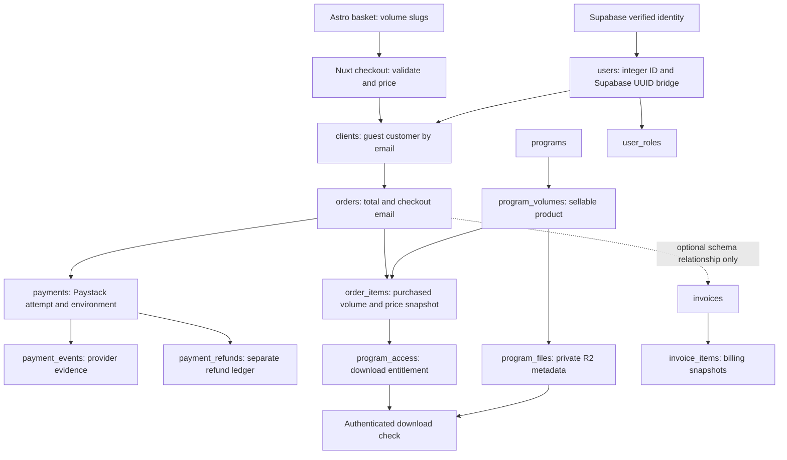

# Paystack production readiness audit

Date: 17 September 2026

Original reviewed revision: `4f1a2247cc51560a5c065ae02cc0ae217a12cd3f`

Remediation update: 17 September 2026 — PAY-01, PAY-02, and PAY-03 implemented and verified locally.

**Recommendation: do not enable live payments yet.** The basic architecture is
sound, but recovery and other launch requirements remain unresolved. Stale
verification, refund matching, and checkout intent retries now have local
fixes and real PostgreSQL tests. Invoicing is not implemented, and other critical payment
paths still need tests. Passing builds alone do not establish payment correctness.

This audit covers the Astro catalogue, basket, checkout and return page; Nuxt
checkout, webhooks, refunds, customer authentication and downloads; admin
purchase reporting and file lifecycle; Drizzle schemas, relevant migrations,
and deployment workflows. The original audit changed documentation only.
The subsequent remediations change code, tests, and add reviewed forward
migrations as documented below. Deployed settings/data are unchanged; migrations
have been applied only to disposable local test databases.

## Production readiness checklist

Check an item only after its fix and acceptance checks are complete. PAY-01,
PAY-02, and PAY-03 are implemented; all other findings remain open. A checked code
fix means locally verified, not deployed. Detailed evidence, conditions, and
acceptance criteria remain in each finding below.

- [x] **PAY-01 (P1):** Prevent stale verification from overwriting settled payments; validate provider evidence and pass PostgreSQL concurrency tests.
- [x] **PAY-02 (P1):** Match refund API responses and webhooks to one refund; test duplicate and reordered events against refund limits.
- [x] **PAY-03 (P1):** Make checkout retries under the same persistent intent idempotent and prevent duplicate payable orders.
- [ ] **PAY-04 (P1, conditional):** Validate Paystack key/mode agreement and demonstrate test/live database and entitlement isolation.
- [ ] **PAY-05 (P1):** Implement independent payment/refund recovery and a defined dispute handling process.
- [ ] **BILL-01 (P1 for complete billing):** Implement invoice creation, issue/delivery, settlement, and refund/credit handling.
- [ ] **TEST-01 (P1):** Cover the remaining critical payment/API/browser paths and gate deployment on automated tests. PAY-01's new tests are only partial progress here.
- [ ] **WEB-01 (P2):** Preserve basket items during temporary catalogue errors.
- [ ] **WEB-02 (P2):** Keep the submitted basket and pending checkout references consistent during edits/retries.
- [ ] **WEB-03 (P2):** Display partial/full refund and reversal statuses accurately on the return page.
- [ ] **ACCESS-01 (P2):** Send post-payment access instructions automatically with durable delivery retries.
- [ ] **ACCESS-02 (P2):** Respect entitlement start times and preserve access across overlapping purchase/manual grants.
- [ ] **ACCESS-03 (P2):** Prevent archived/unpublished programs from losing files owed to existing buyers.
- [ ] **DB-01 (P2):** Enforce invoice/order customer consistency with a forward migration and database tests.
- [ ] **DB-02 (P2):** Separate customer profile edits from immutable paid-order history and financial corrections.
- [ ] **SEC-01 (P2):** Add shared abuse controls, trusted ingress identity, verification throttling, and email recipient cooldowns.
- [ ] **SEC-02 (P2):** Minimize retained provider data and define a tested retention/access policy.

### Launch validation (separate from code fixes)

- [ ] Run the complete two-volume checkout in an isolated Paystack test environment and verify payment/order/items/access/admin reports.
- [ ] Verify closed-browser fulfillment, repeat login, and unauthorized download denial.
- [ ] Verify partial/full refunds, duplicate/reordered webhooks, and recovery from a missed event.
- [ ] Confirm intended-production migrations, RLS/grants, composite constraints, and refund-overage trigger.
- [ ] Test order-line totals, payment/order currency consistency, and settled snapshot immutability; document and enforce the required database/application boundaries.
- [ ] Confirm production-only secrets, database, private buckets, trusted proxy configuration, and Paystack webhook delivery.
- [ ] Confirm email configuration and actual delivery/retry behavior.
- [ ] Record launch evidence and perform the explicitly authorized go-live smoke test in [deployment.md](../deployment.md).

## Original audit evidence and limits

- `pnpm test:coverage`: **66 existing tests passed**, across 17 files. Admin
  statement coverage was **9.82%**; `server/services/paystack.ts`, payment API
  handlers, customer authentication, and download handlers had **0% coverage**.
- Web statement coverage was **85.71%**, but the configured scope is only
  `src/scripts/**/*.ts`: it does not cover the checkout script embedded in
  `index.astro`, the return page, or browser interactions.
- Two additional, temporary Vitest probes executed the real Paystack service
  with mocked database/provider dependencies. Both reproduced the defects in
  PAY-01 and PAY-02. These were diagnostic reproductions of current behavior,
  not permanent regression tests or PostgreSQL integration tests. The temporary
  test file was removed after execution.
- `pnpm check`, `pnpm build:web`, and `pnpm build:admin` passed using Turborepo
  cache results for the unchanged application sources. The admin build retains
  dependency annotation and bundle/performance warnings.
- `pnpm db:check` passed. This checks migration metadata; it does **not** prove
  migrations are applied to a deployed database, that live RLS/grants match the
  repository, or that concurrent transactions behave correctly.
- No real charges, refunds, customer emails, or production database writes were
  made. Deployed secrets, proxy trust configuration, database contents, bucket
  permissions, and Paystack dashboard settings were not inspected. No browser
  end-to-end payment was performed.
- Provider payload assumptions were checked against the official Paystack
  documentation linked beside the relevant findings.

## How the current records link

1. The basket stores slugs in browser storage. Checkout resolves them to
   published database volumes with ready files, checks displayed prices, and
   calculates an authoritative ZAR total in cents.
2. Email is normalized and used to reuse a `clients` row. Merely entering an
   email does not authenticate a buyer or grant access. Checkout inserts one
   order, one item per volume, and one pending payment.
3. An accepted success event updates the payment/order and grants access in a
   transaction. Individual payments are locked during webhook processing.
4. Customers explicitly request a magic link. Supabase verifies the identity;
   the application links `users.id` to `clients.user_id` and grants the customer
   role. Authenticated downloads check that client's active entitlement and
   issue a five-minute signed URL for the configured private bucket.
5. The admin client list follows `clients -> orders -> order_items`. Catalogue
   reporting counts sold items and distinct buyers using qualifying orders and
   payments. Gross sales and active access are different measures; a refund is
   not a deletion of historical sales. The dashboard filters Paystack revenue
   by configured payment environment.
6. `invoices.order_id` can point to an order, and `invoice_items` can point to
   volumes. **No application flow currently creates, issues, emails, or settles
   these invoices.** There is no implemented payment allocation to invoices.

Relevant source: [checkout and payment service](../../apps/admin/server/services/paystack.ts),
[client reporting](../../apps/admin/server/services/client-management.ts),
[catalogue reporting](../../apps/admin/server/services/program-catalogue.ts),
[sales schema](../../packages/db/src/schema/sales.ts),
[access schema](../../packages/db/src/schema/access.ts), and
[invoice schema](../../packages/db/src/schema/invoicing.ts).

## Protections already present

- Zod validation limits baskets to ten unique volumes; quantities are one.
  The server rejects stale prices and calculates its own total.
- Checkout requires an allowed origin, honeypot validation, rate limiting, and
  Turnstile; production fails closed when Turnstile is unconfigured.
- Raw-body HMAC-SHA512 signatures are checked before processing webhooks, with
  a constant-time comparison. This matches
  [Paystack's signature specification](https://paystack.com/docs/payments/webhooks/).
- Successful charges must match the stored reference lookup, amount, currency,
  and payment environment. A browser redirect alone cannot grant access.
- Success processing uses a transaction, payment row lock, and event uniqueness.
  Already fulfilled/refunded payments resist ordinary success replays.
- Refund initiation requires admin authorization and same-origin checks. It
  reserves amounts before the provider request and blocks another unsettled
  refund. A database trigger independently caps non-failed refunds.
- Integer application IDs, integer-cent amounts, and composite ownership
  foreign keys protect order items and purchase entitlements. Application
  tables have RLS enabled in the schema/migrations.
- Authenticated customer queries scope downloads to the linked client, active
  access, ready files, and the configured bucket. Admin uploads require
  authorization and object metadata verification before publication.

These protections should be retained while fixing the findings below.

## Findings and remediation backlog

P1 means fix or resolve the stated launch condition before enabling live
payments. P2 means a concrete correctness, security, or operational issue to
schedule before the affected capability is relied upon. Conditional findings
identify their prerequisites; they are not claims about uninspected production
configuration.

| ID | Priority | Finding |
| --- | --- | --- |
| PAY-01 | P1 — fixed locally | Stale verification can overwrite a successful/refunded payment |
| PAY-02 | P1 — fixed locally | Refund API responses and webhooks do not reliably match the same refund |
| PAY-03 | P1 — fixed locally | Checkout retries create independent payable orders |
| PAY-04 | P1, conditional | Key/environment mismatch and test entitlements are not isolated by code |
| PAY-05 | P1 | Missing recovery for missed/out-of-order events and disputes |
| BILL-01 | P1 for complete billing | Invoice lifecycle is absent |
| TEST-01 | P1 | Critical payment paths lack tests and deployment test gates |
| WEB-01 | P2 | Temporary catalogue errors permanently remove basket items |
| WEB-02 | P2 | Basket changes during submission can disagree with the charged selection |
| WEB-03 | P2 | Refund statuses are displayed as if payment never succeeded |
| ACCESS-01 | P2 | No automatic post-payment email or durable delivery retry |
| ACCESS-02 | P2 | Entitlement start times and overlapping grants are mishandled |
| ACCESS-03 | P2 | Unpublishing enables removal of the last file owed to existing buyers |
| DB-01 | P2 | Invoice/order customer consistency is not enforced |
| DB-02 | P2 | Editing a paid manual order deletes its financial history |
| SEC-01 | P2 | Public verification and email abuse controls need strengthening |
| SEC-02 | P2 | Full provider payloads retain unnecessary sensitive payment data |

### PAY-01 — stale verification can overwrite settled state

**Status: completed locally, 17 September 2026.** Not yet deployed.

**Original evidence:** [paystack.ts](../../apps/admin/server/services/paystack.ts), lines
1022–1071, especially 1024–1029 and 1052–1061.

The verifier reads `pending` before awaiting Paystack. Its non-success branch
later updates the payment by ID alone, without locking and rechecking its
current state. A success or refund webhook can commit during that wait. A
stale `failed`/`abandoned` result then overwrites the payment, while the guarded
order update can leave the order `paid` and its access active. Refund totals
can likewise coexist with an incompatible payment status. Terminal responses
also lack the amount/currency/environment/reference validation used by the
success handler.

**Reproduced:** a temporary probe began with a pending payment, simulated a
success webhook while `$fetch` was pending, and returned an older failed
verification. Final state: payment `failed`, order `paid`.

**Fix:** validate the provider result against the requested payment; lock and
reread the payment inside the update transaction, or use a conditional update
and require a returned row before changing related records. Apply explicit,
monotonic transition rules for settled states.

**Acceptance:** deterministic overlapping verification/success/refund tests
plus a real PostgreSQL concurrency test. No stale response may downgrade a
settled payment, change its refund totals, or recreate revoked access.

**Implemented remediation:**

- [x] Validate the successful verification envelope and required transaction fields with a shared Zod contract; require reference, integer-cent amount, currency, and environment to match the stored payment before any write.
- [x] Make non-success writes conditional on `payments.status = 'pending'` inside the transaction and require an updated row before changing orders/access. PostgreSQL rechecks this predicate after waiting on a concurrent update; see [Read Committed behavior](https://www.postgresql.org/docs/current/transaction-iso.html#XACT-READ-COMMITTED).
- [x] Keep success reconciliation on the existing locked, idempotent webhook fulfillment path.
- [x] Add 18 unit tests for invalid/mismatched evidence, already-settled payments, and provider failures.
- [x] Add and run 29 PostgreSQL integration tests using the actual repository migrations: normal verification, repeated success, a matrix of stale responses after success/partial refund/full refund/reversal, an actual uncommitted webhook row-lock overlap, later success after failure, and atomic rollback.

Tests are in [unit tests](../../apps/admin/tests/paystack-verification.test.ts)
and [PostgreSQL tests](../../apps/admin/tests/paystack-verification.integration.test.ts).
See [test instructions](../../apps/admin/tests/README.md) to rerun them. The
integration run used a disposable local PostgreSQL 18 cluster and mocked
provider responses; it did not contact Paystack or test deployed Supabase
authentication/RLS policies. At PAY-01 completion the ordinary suite had
**84 passing tests** and the opt-in database suite had **29 passing tests**.
See PAY-03 below for the latest totals. Broader test coverage and CI
gates remain tracked under TEST-01. `pnpm check`, `pnpm build:admin`, and
`pnpm build:web` also passed after the code change (both production builds ran
uncached). Existing admin dependency annotation and bundle warnings remain.

### PAY-02 — refund identity is inconsistent across response and webhook

**Status: completed locally, 17 September 2026.** Not yet deployed.

**Implemented:** separate unique API-ID and webhook-reference columns; match
known identities with payment/amount/currency checks, or bind an unambiguous
reservation even when its API ID is already saved. Preserve terminal states
when events arrive out of order. Missing, ambiguous, or contradictory evidence
is recorded for review without creating another refund. All paths use the same
payment-first lock order. Historical mixed identifiers are matched conservatively.

Seven added PostgreSQL tests cover partial/full null-reference refunds, numeric
IDs and differing references, webhook-before-response, duplicate/reordered
events, equal partial refunds, ownership conflicts, uncertain requests, and
remaining refund limits. The database suite passed 36 tests. Apply the reviewed
forward migration `20260917143554_concerned_living_mummy.sql` before deploying
this service. It adds a nullable reference and partial unique index without
rewriting historical IDs; unresolved historical refunds still require review.

**Evidence:** [paystack.ts](../../apps/admin/server/services/paystack.ts), lines
617–659, 703–710, and 926–943; the
[refund cap trigger](../../supabase/migrations/20260907093011_spooky_triton.sql),
lines 43–76.

The refund API path stores `data.id` when `refund_reference` is absent. The
webhook path searches by `refund_reference`/`id`, then falls back only to local
refunds whose provider ID is null. Paystack documents a webhook with a null
refund reference and no refund ID, while its creation response includes an ID.
See the [official refund examples](https://paystack.com/docs/payments/refunds/).

After the creation response saves its ID, that documented webhook shape cannot
match the reservation. The service inserts another refund. A small partial
refund can reserve money twice; a full refund will exceed the database cap and
roll back the webhook. The same weakness applies when API IDs and webhook
references are different identifiers.

**Reproduced:** starting with a R100 payment and an existing R30 pending refund
with a saved provider ID, the real handler with mocked database dependencies
inserted a second R30 row for a null-reference pending webhook. The local active
refund sum became R60. The full-refund trigger consequence was established by
SQL inspection, not a live database test.

**Fix:** distinguish provider refund IDs from processor references. Reconcile
against the provider's authoritative refund record and validate payment,
environment, currency, and amount before updating it. Ambiguous webhook
identity must remain pending reconciliation, not cause another reservation.
Handle either webhook/API-response arrival order.

**Acceptance:** fixture tests for null, missing, numeric, and differing
identifiers; API response before/after webhook; two equal partial refunds;
duplicate and reordered events; full refunds. One real refund must map to one
local refund throughout its lifecycle.

### PAY-03 — checkout has no request idempotency or resumable attempt

**Status: completed locally, 17 September 2026.** Not yet deployed.

**Implemented remediation:**

- [x] Require an unpredictable intent token on both single-volume and basket checkout; share request normalization across browser/server and document it in OpenAPI.
- [x] Persist paired key/request hashes on payments with real uniqueness/hash constraints, serialize reservation creation, and reject changed details under an existing key.
- [x] Claim initialization durably before network I/O. Concurrent requests and lost-browser-response retries reuse one order/reference/saved hosted URL. Provider initialization and verification use bounded timeouts with automatic retries disabled.
- [x] Keep ambiguous initialization pending under its existing reference; distinguish explicit rejection, reconcile uncertainty through existing validated verification, and preserve concurrent webhook settlement. Never automatically invent a replacement reference.
- [x] Persist browser keys across retries/reloads and serialize modern cross-tab storage with Web Locks. Validate recovery references and status responses; retire confirmed terminal intents for deliberate later purchases/retries. Use the submitted item snapshot when remembering checkout.
- [x] Add 20 real PostgreSQL checkout cases plus unit/contract/browser-helper tests for purchase identity, validation, unsafe URLs, storage failures, recovery, and status evidence.

**Verification:** 124 ordinary tests and 56 opt-in PostgreSQL tests passed;
lint/type checks, migration checks, and both production builds passed. Provider
responses were fixtures, not real charges. See [checkout-idempotency.md](../checkout-idempotency.md)
for behavior, recovery, limitations, and test/rollout instructions. The reviewed
forward migration is `20260917144154_careful_arachne.sql`; coordinate backend and
frontend deployment because `idempotencyKey` is now required.

**Limits:** idempotency protects the same intent, not all purchases using an
email address. Fresh keys represent deliberate separate purchases. Clearing
browser storage/changing devices loses that browser association; simultaneous
first creation across tabs requires Web Locks. Pending uncertainty never
expires into a fresh payable reference automatically. Independent operator/
provider recovery remains PAY-05, broader CI/browser launch gates remain TEST-01,
and WEB-02's other in-flight basket/pending-reference behavior remains open.

**Original evidence and acceptance:**

**Evidence:** [paystack.ts](../../apps/admin/server/services/paystack.ts), lines
195–262 and 298–315; [checkout contract](../../packages/contracts/src/checkout.ts).

Every accepted submission generates a new order and payment reference. There
is no checkout-intent/idempotency key, lookup of a previously initialized
attempt, or request fingerprint. A lost initialization response, reload, or
second tab can produce multiple valid Paystack checkout links for the same
intended purchase. Paying both creates two charges; the entitlement uniqueness
constraint only limits access rows, not charges. Disabling one browser button
does not solve retries across requests.

**Fix:** persist an unpredictable checkout-intent key bound to normalized
customer and basket details, with a unique database constraint and a safe
resume/reconcile path. Keep uncertain provider results distinguishable from
confirmed rejection. Permit deliberate later purchases without merging them
into old intents. Add bounded provider timeouts and explicit retry policy.

**Acceptance:** duplicate simultaneous requests and retry after a lost response
reuse the same payable intent. A changed basket cannot reuse its key silently.

### PAY-04 — environment safety depends on unverified configuration

**Evidence:** [paystack.ts](../../apps/admin/server/services/paystack.ts), lines
195–203, 391–437, and 749–754;
[customer linking](../../apps/admin/server/utils/customer-auth.ts), lines 19–29;
[customer file API](../../apps/admin/server/api/customer/files/%5Bid%5D.get.ts);
[deployment guidance](../deployment.md).

Initialization accepts a nonempty secret without checking that `sk_test_` or
`sk_live_` matches `paystackEnvironment`. A live key with the default `test`
setting can create a real charge recorded locally as test; the subsequent
environment check then rejects fulfillment. Callback/account URLs also retain
localhost defaults and have no backend production-host validation.

Separately, test payments grant ordinary `program_access` rows. Login,
entitlement consumption, and replacement-access lookup do not require a
matching payment environment. **If test and production share a database, or
test orders remain in the database promoted to live**, those grants can unlock
production files for the same volume. Separate bucket names do not isolate an
entitlement. Deployment documentation currently permits shared early-stage
database use, so this must be resolved before launch.

**Fix:** fail startup/checkout on inconsistent key, mode, or production URLs.
Require isolated production database/auth/storage configuration and a reviewed
test-data transition, or explicitly model and enforce environment ownership
throughout access and reporting. Never just relabel test payments as live.

**Acceptance:** all key/mode mismatches fail before provider initialization;
test purchases cannot authenticate into or download production entitlements;
production URLs cannot fall back to localhost.

### PAY-05 — no independent recovery or dispute lifecycle

**Evidence:** [paystack.ts](../../apps/admin/server/services/paystack.ts), lines
599–615 and 958–1071; [status route](../../apps/admin/server/api/checkout/status.get.ts),
lines 10–19. Repository search found no scheduled payment/refund reconciliation
or admin replay flow.

Verification happens only when a browser polls a payment still marked pending.
If the customer closes the page and webhook delivery never succeeds, payment
and access can remain unresolved. A refund delivered before charge fulfillment
is recorded as failed and acknowledged; the same event key is subsequently
ignored, even if the prerequisite charge has arrived. An uncertain refund can
remain reserved indefinitely without provider reconciliation.

Only charge success and refund events are handled. Dispute events are stored
as ignored, and already successful payments are not periodically reverified.
An adverse dispute/reversal therefore has no implemented accounting/access
policy or alert. Paystack's [webhook documentation](https://paystack.com/docs/payments/webhooks/)
describes finite retries and dispute event types; those cannot replace local
recovery.

**Fix:** add a durable reconciliation job for stale payments and unresolved
refunds, with backoff, alerts, and a controlled replay mechanism. Distinguish
permanently invalid events from events awaiting prerequisite state. Define
dispute outcomes and entitlement policy without treating every opened dispute
as a completed refund.

**Acceptance:** closed-browser success, missed webhook, refund-before-charge,
provider timeout, and adverse dispute scenarios converge to correct records
without direct database editing or duplicate fulfillment.

### BILL-01 — invoices are schema only

**Evidence:** [invoice schema](../../packages/db/src/schema/invoicing.ts);
[admin navigation](../../apps/admin/app/layouts/dashboard.vue), line 13;
[successful payment handler](../../apps/admin/server/services/paystack.ts),
lines 525–585. Repository searches found no invoice service/API or insertion
into `invoices`/`invoiceItems`; the navigation entry is disabled.

A purchase currently creates orders, items, payments, and access, but no
application invoice, invoice PDF, invoice email, paid invoice state, or refund
credit adjustment. The relationship exists in the schema only. A possible
Paystack receipt is not an implemented Tilana invoice lifecycle.

**Fix:** implement idempotent invoice creation from immutable order snapshots,
seller/customer billing snapshots, numbering, private PDF access, delivery,
settlement linkage, and correction/refund history. For multiple payment
attempts, define whether settlement is derived from the order or represented
through explicit allocations. Select and document billing requirements before
claiming this capability is complete.

**Acceptance:** a two-volume payment produces one intended issued/paid invoice
with two correct lines; replay does not duplicate it; changed catalogue prices
do not alter it; partial/full refund adjustments remain traceable.

### TEST-01 — passing tests do not exercise the financial workflow

**Evidence:** [admin Vitest configuration](../../apps/admin/vitest.config.ts),
[web Vitest configuration](../../apps/web/vitest.config.ts), existing tests,
and [deployment workflows](../../.github/workflows/).

Current tests cover contracts, signature helpers, extracted policies and
selected wrappers, but not payment initialization, transactional fulfillment,
refund orchestration, customer linking, or actual HTTP/download authorization.
The coverage results above confirm the gap. Both deployment workflows build
without running `pnpm test`; there is no separate test workflow in this revision.

**Fix:** add service/route tests with realistic provider fixtures, PostgreSQL
integration tests for locks/constraints/rollback, and browser tests for the
basket-to-return-page flow. Gate deployments on tests and checks; do not mask
untested financial behavior behind an aggregate coverage percentage.

**Acceptance:** the cases specified throughout this audit run in CI, including
the two reproduced defects, unauthorized access, webhook replay, refund
overages, and concurrent operations. A failing financial test blocks deployment.

### WEB-01 — transient HTTP failures erase the basket

**Evidence:** [checkout page](../../apps/web/src/pages/checkout/index.astro),
lines 172–205.

`fetchVolume` returns null for every non-OK response or invalid response body,
including a temporary 500/503 or proxy HTML response. `loadBasket` writes only
the surviving volumes back to local storage. A temporary backend failure can
therefore permanently empty a customer's basket and incorrectly claim the
programs are no longer available.

**Fix/acceptance:** distinguish definitive unavailability from retryable
failure. Preserve selections on timeout, 429, 5xx, or malformed responses;
display a retry state. Test one failing item and all failing items. A stale
price reload must also bypass stale catalogue caches or explain that a fresh
price could not yet be retrieved.

### WEB-02 — the displayed basket can change during initialization

**Evidence:** [checkout page](../../apps/web/src/pages/checkout/index.astro),
lines 149–156, 217–241, and 260; [basket storage](../../apps/web/src/scripts/basket.ts).

Submitting disables only the payment button. Remove buttons remain usable
while the request is in flight. The request contains the original selection,
but the pending-basket record uses mutable `selectedVolumes` after the response.
For example, submit A+B, remove B while waiting, then get redirected to pay for
A+B while the page had changed to A. Only one pending reference is stored, so
parallel tabs can also overwrite one another's cleanup state. Checkout does
not reconcile cross-tab storage changes before submitting.

**Fix/acceptance:** freeze a submitted basket snapshot, lock basket edits during
initialization, guard reentrant submission, and persist pending selections by
reference. Test delayed responses, remove clicks, reload, and parallel tabs.
The selection shown for payment and later cleared must match the submitted one.

### WEB-03 — return-page messages misrepresent refunds

**Evidence:** [return page](../../apps/web/src/pages/checkout/complete.astro),
lines 43–57; [status contract](../../packages/contracts/src/checkout.ts).

Every non-pending status except `succeeded` is shown as “No successful payment
was recorded.” A previously successful but partially refunded payment is
therefore presented as unpaid and loses the program-access link. Fully refunded
and reversed payments also get an inaccurate payment-failure message. The
processing fallback asks the user to provide a reference without displaying it.

**Fix/acceptance:** render each supported payment status explicitly, preserving
access guidance for partial refunds and offering clear refund/support details.
Check HTTP and response-schema validity, show the payment reference, and test
revisiting the callback after partial/full refunds and a delayed confirmation.

### ACCESS-01 — payment does not automatically send access instructions

**Evidence:** [charge fulfillment](../../apps/admin/server/services/paystack.ts),
lines 578–584; [magic-link route](../../apps/admin/server/api/customer/auth/magic-link.post.ts),
lines 28–56; [email service](../../apps/admin/server/services/customer-access-emails.ts).

The application sends an access email only after the customer requests it on
the sign-in page. No receipt/access notification is queued by payment success.
A buyer who closes Paystack before returning receives no application-generated
next-step email. Requested email delivery failures are logged and the API
returns the same generic response, with no durable retry. The generic response
is appropriate for privacy, but needs operational recovery behind it.

**Fix/acceptance:** create a durable, idempotent post-payment notification job
within the fulfillment transaction and deliver after commit with retry and
monitoring. Explain the intended login flow. Test closed-browser purchases,
duplicate webhooks, provider email failure, and later successful retry.

### ACCESS-02 — overlapping and future access grants are not fully enforced

**Evidence:** [access schema](../../packages/db/src/schema/access.ts), lines
26–40; [ensureAccessForItem](../../apps/admin/server/services/paystack.ts),
lines 391–425; [customer listing](../../apps/admin/server/api/customer/programs.get.ts)
and [download handler](../../apps/admin/server/api/customer/files/%5Bid%5D.get.ts).

The schema supports future `starts_at`, but listing/download checks only status
and expiry. A scheduled grant can be used early if such a row is created.
Also, fulfillment returns immediately when any current active grant exists.
If that grant is an expiring promotion, a paid purchase does not replace it
with the non-expiring purchase access normally created by checkout. After the
promotion expires, the paid buyer can lose access. The unique active
client/volume row makes provenance and overlapping grants especially important.

**Fix/acceptance:** enforce start and expiry consistently; define how multiple
independent grants combine without losing purchase provenance. Test a purchase
during temporary promotional access, future grants, and refunding one of two
paid orders for the same volume, including concurrent events.

### ACCESS-03 — archived programs can lose files for existing buyers

**Evidence:** [file deactivation](../../apps/admin/server/services/program-storage.ts),
lines 476–505; [publication guard](../../apps/admin/server/services/program-catalogue.ts),
lines 149–163; customer listing/download handlers.

The last-file guard protects published programs only. Unpublish/archive a
program, then deactivate its final file: the operation succeeds despite active
paid entitlements. Those customers retain access records but have nothing to
download. Disabling new sales should not silently withdraw previously sold
content. A similar window exists if content is withdrawn after checkout
initialization but before payment succeeds.

**Fix/acceptance:** protect delivery for existing entitlements independently
of publication state; require an atomic replacement or an explicit audited
withdrawal/refund process. Test archive followed by last-file deactivation and
payment completion after unpublishing.

### DB-01 — invoices can refer to another customer's order

**Evidence:** [invoicing.ts](../../packages/db/src/schema/invoicing.ts), lines
15–16; [integer-key migration](../../supabase/migrations/20260906182814_slim_moon_knight.sql),
lines 253–254.

`invoices.client_id` and `invoices.order_id` have independent foreign keys.
Unlike order items, no composite constraint requires the order to belong to
the same client. The database permits an invoice for client A linked to client
B's order. There is no current public invoice write path, so this is a schema
gap to close before implementing billing, not a demonstrated public exploit.

**Fix/acceptance:** add a reviewed forward migration enforcing order/client
consistency while preserving the intended optional-order behavior. Reject a
cross-client invoice in a database integration test. Validate invoice currency,
line totals, and settlement allocations against the intended order model.

### DB-02 — paid manual-order edits destroy historical records

**Evidence:** [updateManualClient](../../apps/admin/server/services/client-management.ts),
lines 234–308.

The edit guard excludes web orders and clients with multiple orders, but still
allows an already paid manual order. Editing that client deletes its access
rows, payments, and order items, then recreates them with a new paid timestamp.
Even an ordinary profile change can rewrite financial history and future
invoice links. This does not currently delete Paystack web orders, but conflicts
with the repository's immutable purchase-snapshot requirement.

**Fix/acceptance:** separate profile editing from financial correction. Make
settled order items/payments immutable; use explicit adjustments with an audit
trail. Test a profile-only edit of a paid manual customer and confirm original
item IDs, prices, payment IDs, and paid time remain intact.

### SEC-01 — verification and email abuse controls are incomplete

**Evidence:** [status route](../../apps/admin/server/api/checkout/status.get.ts),
lines 4–20; [contact security](../../apps/admin/server/utils/contact-security.ts),
lines 15 and 53–99; [auth security](../../apps/admin/server/utils/auth-security.ts),
lines 4–44; [magic-link route](../../apps/admin/server/api/customer/auth/magic-link.post.ts).

Every public poll of a known pending reference can trigger an external verify
request. There is no per-reference cooldown, request coalescing, or status-route
rate limit. An allowed Origin header is not authentication for non-browser
callers. Someone can repeatedly poll their own pending payment and consume
provider/backend capacity.

Checkout and sign-in limiters are process-local, reset on restart, and do not
coordinate across instances. Client IP selection trusts forwarded headers;
checkout prefers `cf-connecting-ip`. Their reliability depends on the actual
trusted proxy chain and blocking/spoof protection on direct backend access,
which was not verified. The auth map also lacks eviction, and magic-link
delivery has no per-recipient cooldown.

**Fix/acceptance:** use a bounded shared limiter, trusted ingress identity,
per-reference verification throttling/coalescing, and recipient cooldowns.
Test direct-origin spoofing, parallel requests, instance changes, and retry
behavior without preventing legitimate callback recovery.

### SEC-02 — raw payment events retain more data than needed

**Evidence:** [event insertion](../../apps/admin/server/services/paystack.ts),
lines 983–991; [payment event schema](../../packages/db/src/schema/sales.ts),
lines 167–195.

The entire signed webhook or verification response is persisted as JSON.
Paystack's [verification response](https://paystack.com/docs/payments/verify-payments/)
can contain customer details and a reusable payment authorization code. This
one-off purchase flow does not need to retain that authorization. No event
redaction or retention policy is implemented. RLS reduces direct exposure but
does not minimize sensitive data in privileged access and backups.

**Fix/acceptance:** verify signatures against the untouched raw request first,
then persist an allowlisted audit record and digest. If full payload retention
is required, define access restrictions, encryption, and a retention policy.
Test that authorization credentials and unnecessary customer data are absent
from ordinary event records/logs while reconciliation evidence remains usable.

## Database assessment beyond the findings

The main ownership chain is appropriate: guest clients are distinct from
authenticated users; volumes are sellable units; order lines snapshot prices;
payments are attempts; refunds are independent records; access is checked
separately from payment UI state. Composite order/item/client/volume foreign
keys are valuable safeguards.

However, the schema's ability to hold several payments per order is not an
implemented retry workflow: current checkout always creates a new order. Before
adding retries to an existing order, fulfillment/refund logic must consider all
its payment attempts rather than allowing one attempt to overwrite the entire
order's state.

Some documented invariants are application conventions rather than database
guarantees. In particular, there is no aggregate constraint tying the sum of
order items to the order subtotal, no payment/order currency constraint, and
no general database protection against modifying settled snapshot fields.
The current checkout writes consistent values transactionally; new import,
manual correction, and invoice flows must preserve them. Add database tests
and choose constraints/triggers where needed instead of assuming that RLS or
individual nonnegative-amount checks enforce these relationships.

## Suggested implementation order and launch evidence

1. PAY-01/PAY-02 are fixed locally with permanent PostgreSQL regression tests;
   apply their migrations and verify deployed behavior during coordinated rollout.
2. PAY-03 intent idempotency is implemented locally. Independent recovery
   (PAY-05) remains open.
3. Verify environment isolation and backend configuration checks (PAY-04).
4. Complete billing, notifications, and historical integrity
   (BILL-01, DB-01, DB-02, ACCESS-01).
5. Resolve basket/return-page behavior, entitlement lifecycle, and abuse/data
   retention findings. Add the corresponding API and browser tests.
6. Gate deployment on those tests. In an isolated test environment, execute a
   two-volume checkout, closed-browser fulfillment, repeat login, unauthorized
   download denial, partial/full refund, duplicate webhook, and recovery from a
   missed event. Verify records and admin reports after every transition.

Before live enablement, verify deployed migrations/RLS and the refund trigger,
production-only secrets/database/buckets, Paystack webhook delivery, and email
delivery configuration. Record actual evidence from the intended production
configuration, then perform the explicitly authorized go-live smoke test
described in [deployment.md](../deployment.md). This audit does not authorize
that deployment or financial test.
