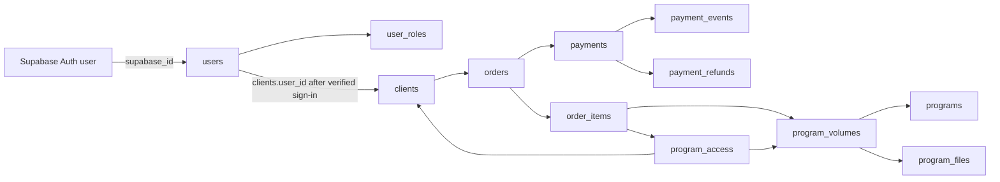
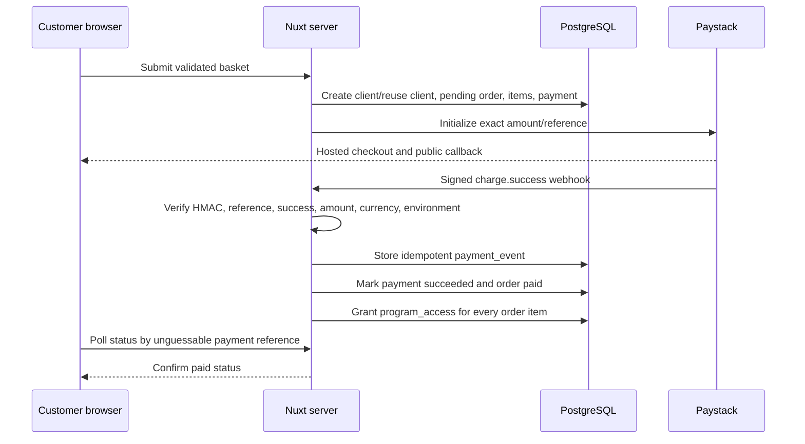

# Program publishing, purchase, and customer access

This document describes the implemented end-to-end flow for creating a program,
selling one or more program volumes in one checkout, granting customer access,
and showing the result in the admin portal. It also records the security
boundaries and the operational checks required before accepting live payments.

## The short version

- A program is the public catalogue card. A program volume is the individual
  product with its own slug, price, publication state, and one or more PDFs.
- The public Astro site may put up to ten unique program volumes in a browser
  basket. The basket is only a convenience; the Nuxt server reloads every item
  and price from PostgreSQL before creating an order.
- One checkout creates one order, one order item per selected volume, and one
  pending Paystack payment.
- A customer is identified by a normalized, case-insensitive email address.
  Buying again with the same email reuses the same `clients` row but creates a
  new order and payment history.
- Only a signed Paystack webhook or a server-to-server Paystack verification
  can mark the order paid and grant `program_access`.
- The customer requests a passwordless sign-in email after payment. Supabase
  verifies the identity; AWS SES sends the branded email. A verified account is
  linked to the existing client and receives the `customer` role.
- A private PDF is returned only after the Nuxt server verifies the signed-in
  user, customer role, linked client, and active entitlement. The resulting R2
  download URL lasts five minutes.
- Admin reporting links purchases through
  `clients -> orders -> order_items -> program_volumes -> programs`.

## System boundaries

| Component | Responsibility | Trust level |
| --- | --- | --- |
| Public Astro site | Catalogue presentation, local basket, checkout form, payment-status screen | Public browser; never trusted for price or payment state |
| Nuxt admin/server | Validation, authentication, business rules, database access, Paystack, email, and R2 signing | Trusted server boundary |
| PostgreSQL/Drizzle | Catalogue, clients, orders, payments, webhook ledger, roles, and entitlements | Source of application state |
| Supabase Auth | Admin password sessions and customer passwordless sessions | Authentication identity provider |
| Paystack | Hosted payment and refund processing | Payment provider; signed server data is payment truth |
| AWS SES | Branded customer access email delivery | Outbound email provider |
| Cloudflare R2 | Public cover images and private program PDFs | Object storage; private objects are never exposed directly |

All application primary and foreign keys are integers. The one application
schema UUID is `users.supabase_id`, which bridges an application user to
Supabase Auth.

## Relationship map

The links have deliberately different meanings:

- `clients` is the business/customer record and can exist before login.
- `users` is the application profile for a verified Supabase identity.
- `user_roles` controls privileges. Customers are explicitly assigned the
  `customer` role; they are not treated as administrators.
- `orders` and `order_items` are purchase history. Item description and price
  are snapshots and do not change when catalogue details change later.
- `program_access` is the current delivery entitlement. It is not inferred from
  the browser basket or merely from the existence of an order.

## Admin flow: how a new program becomes purchasable

The intended workflow for the site administrator is:

1. Sign in to the Nuxt admin site with a Supabase account whose application
   user has an `admin` role.
2. Open **Programs** and create the program. It starts as `draft`.
3. Fill in its public name, card label, headline, description, accent, slug, and
   ordering.
4. Upload a cover image. The browser asks the authenticated Nuxt server for a
   short-lived signed upload URL, uploads directly to the configured public R2
   media bucket, and asks the server to finalize it.
5. During finalization the server checks that the object exists and that its
   content type and size match the reserved upload. The previous active cover,
   if any, is deactivated only after the new upload is verified.
6. Add a volume. Each volume starts unpublished and has its own unique checkout
   slug, volume number, name, price in integer cents, currency, and sort order.
7. Upload the PDF in the same reserve, direct-upload, finalize sequence. PDFs
   go to the environment's private R2 bucket. Replacing a PDF retains the old
   database history and activates the verified replacement.
8. Publish the volume. The server refuses this unless the volume has a valid
   slug, positive ZAR price, and at least one active, ready PDF in the correct
   private bucket.
9. Publish the program. The server checks all required public copy, an active
   ready cover in the correct public bucket, and at least one sellable published
   volume with a ready private file.

Draft or archived programs do not appear in the public catalogue. Returning a
program to draft or archiving it blocks new sales but preserves purchase history
and existing customer access. The service also prevents edits that would leave
an already-published program invalid. Catalogue changes are recorded in
`program_audit_events` without secrets or signed URLs.

## Public flow: multiple programs in one purchase

1. The Astro catalogue loads only server-approved published programs and
   volumes. A volume is available only when its program and volume are
   published, its price is positive ZAR, and a ready private PDF exists.
2. **Add to basket** stores the volume slug in browser `localStorage`. Duplicate
   slugs are removed and the basket is limited to ten items.
3. The checkout page reloads every selected volume from the public catalogue
   API. Removed or unpublished items are removed from the local basket, and the
   latest displayed price is used for review.
4. The customer supplies a name, email, optional phone number, and privacy
   consent. The request is checked by a shared Zod contract, honeypot, rate
   limit, allowed-origin CORS policy, and Cloudflare Turnstile when configured.
5. The Nuxt server validates all slugs again, confirms publication and private
   file readiness, loads authoritative database prices, and rejects a stale
   browser price with `409` so the customer must review the new total.
6. The server normalizes the email to lowercase. The case-insensitive unique
   email constraint either reuses the existing client or creates one safely
   under concurrent requests.
7. One pending order is created with one immutable item per selected volume.
   One pending Paystack payment is created for the exact integer-cent total.
8. Paystack initialization returns a hosted authorization URL. The browser is
   redirected to Paystack and never sees the secret key.

If Paystack cannot initialize, the pending payment becomes failed and its
pending order becomes cancelled. A failed or abandoned server verification also
cancels the pending order. These records remain useful for support and auditing.

### What happens when the same customer buys again?

`clients.email` has a case-insensitive unique index. `Person@Example.com` and
`person@example.com` therefore resolve to the same client. The existing client
profile is not overwritten from the unverified checkout form. A new order,
order items, and payment are still created, preserving every purchase.

If the second order contains a new volume, successful payment grants that new
entitlement to the same client. If it contains a volume the customer already
owns, access stays active without creating two simultaneous active entitlements,
while both paid orders remain in purchase history.

Using a different email creates a different client and a different future login
identity. Purchases are not automatically merged across different email
addresses; an administrator would need a reviewed support process to correct
the data.

## Payment confirmation and entitlement creation

The browser callback is only a status display. It cannot grant access.

If the callback arrives before the webhook, the status endpoint performs a
server-to-server Paystack verification. The same strict fulfillment path is
used. Each raw signed provider event is hashed into a unique
`payment_events.provider_event_key`, making webhook retries no-ops.

Fulfillment requires an exact match for:

- provider reference;
- Paystack status `success`;
- amount in cents;
- currency; and
- payment environment (`test` or `live`).

A replayed success event cannot overwrite a partial refund, full refund, or
reversal. A processed partial refund keeps the order paid and access active. A
processed full refund marks the order and payment refunded and revokes access
from that order. If another paid order independently provides the same volume,
the valid entitlement remains active.

## Customer email and login flow

There is no automatic program email sent merely because the browser reached the
payment-complete page. This avoids treating the browser callback as fulfillment
and avoids sending a reusable login link before the customer asks for one.

The current flow is:

1. After confirmed payment, the public completion page shows **Access my
   programs**, linking to the Nuxt customer sign-in page.
2. The customer enters the same email used for purchase.
3. The server always returns the same generic response, whether the email is
   known or not, so the form cannot reveal customer membership.
4. Only an email with at least one paid order is eligible. The endpoint is
   same-origin protected and rate limited.
5. The server uses the Supabase administrative client to generate a passwordless
   token without sending Supabase's default email.
6. The project renders a branded email and AWS SES delivers it. Development can
   redirect all delivery to `NUXT_CUSTOMER_ACCESS_DEVELOPMENT_RECIPIENT`; the
   token still represents the intended test customer.
7. The customer clicks the link. The Nuxt callback verifies the one-time token
   with Supabase, creates or reuses the integer-keyed `users` row, links
   `clients.user_id`, and inserts the `customer` role.
8. Later visits use the Supabase session. The customer can request a fresh
   passwordless link with the same email; no duplicate user or client is made.

Program PDFs are links in the customer account, not email attachments.

## Customer program and download checks

`GET /api/customer/programs` requires all of the following:

- a valid Supabase session;
- a matching `users.supabase_id`;
- an explicit `customer` row in `user_roles`;
- a linked `clients.user_id`; and
- active, unexpired `program_access` for each returned volume.

`GET /api/customer/files/:id` repeats the customer and entitlement checks and
also requires an active, ready file in the configured private-program bucket.
Only then does the server redirect to a five-minute, read-only signed R2 URL.
Knowing a file ID or object key is not enough to download it.

## What the administrator sees after a sale

The **Clients** page joins the reused client to all of their orders and order
items. This is where the administrator can inspect which volumes a customer
bought, the order number and status, Paystack payment state, refunds, and the
currently configured Paystack environment.

The **Programs** pages show three deliberately different measures:

| Measure | Meaning |
| --- | --- |
| Paid customers | Distinct clients with a currently paid order for the volume or program. One customer buying two volumes in the same program counts once at program level. Fully refunded orders are excluded. |
| Gross sales | Sum of immutable paid order-item snapshots, including sales later refunded. Use the payment/refund views for net settlement reporting. |
| Active access | Distinct clients with an active, unexpired entitlement. This can be lower after a refund, manual revocation, or expiry. |

Program reporting includes manual payments plus Paystack payments in the
server's currently configured environment. Test and live Paystack sales are not
mixed. The dashboard's sales and payment alerts use the same current Paystack
environment.

For a simple question such as “how many customers bought this program?”, use
**Paid customers**. For support on a particular person, use **Clients**.

## Manual admin-created customers and purchases

The Clients screen can create a manual customer and order. A manual order marked
`paid` grants access and, for a positive total, creates a succeeded manual
payment. A manual order marked `pending` records the intended assignment but
does not grant program access. Automated web purchases cannot be rewritten by
the manual editor.

## Security review checklist

The implemented flow has the following controls:

- database prices and publication status are authoritative;
- money is stored and compared as integer cents;
- browser callbacks cannot mark payments paid;
- Paystack signatures use SHA-512 HMAC and timing-safe comparison;
- fulfillment checks exact reference, environment, status, amount, and currency;
- webhook processing is idempotent and refund overages have service and database
  protection;
- all reviewed admin state-changing routes require an admin role and same-origin
  request validation;
- public checkout uses schema validation, CORS restrictions, rate limiting,
  honeypot, and Turnstile support;
- passwordless sign-in does not disclose whether an email has purchased;
- customer APIs require both identity linkage and the customer role;
- private downloads require a current entitlement and short-lived signed URL;
- RLS is enabled and anonymous database writes are not used;
- service-role, Paystack, SES, Turnstile, and R2 credentials remain server-only;
- upload and download R2 credentials are separate and scoped by environment;
- catalogue changes and payment webhooks retain audit history.

The in-memory abuse rate limiter is appropriate as a secondary control for the
current small deployment but is not a globally shared quota across multiple
server instances. Turnstile and origin controls remain important. If the Nuxt
application is scaled horizontally or abuse increases, move rate-limit state to
a shared store.

## Pre-live operational verification

Passing application tests does not prove that third-party production accounts
are configured correctly. Before live sales, verify this checklist in the target
environment:

1. Use separate production database/Supabase and R2 resources where possible.
2. Confirm every public build-time API URL points to the matching admin host.
3. Confirm the Turnstile site key allows the deployed public hostname. For local
   testing use a Cloudflare test key or leave the local site key blank; a
   production-only hostname key will fail on `127.0.0.1`.
4. Confirm Paystack secret, environment, callback, and signed webhook URL all
   belong to the same environment.
5. Confirm the AWS SES sender is verified and production does not set the
   development recipient override.
6. Confirm the Supabase public and service-role keys belong to the matching
   project and that allowed redirect URLs include the customer confirmation
   endpoint.
7. Confirm the public-media R2 domain works and PDFs are in a private bucket.
8. Confirm the download credential is read-only and the upload credential is
   limited to the two matching buckets.
9. Run one low-value end-to-end live purchase: multiple basket items, successful
   webhook, email request, login, every download, admin customer view, program
   buyer count, partial refund, and full refund/access revocation.
10. Inspect payment alerts for stale or failed checkouts and any refund marked
    `needs-attention`.

Do not make the production Paystack switch by changing only one secret. The
environment, key, callback, webhook, deployment URLs, and final live test must
be changed and reviewed together. See [deployment.md](./deployment.md) for the
complete environment configuration and release procedure, and
[database-design.md](./database-design.md) for database constraints and RLS.

## Useful implementation entry points

- Public basket and checkout: `apps/web/src/scripts/basket.ts` and
  `apps/web/src/pages/checkout/index.astro`
- Payment completion screen: `apps/web/src/pages/checkout/complete.astro`
- Checkout, fulfillment, and refunds:
  `apps/admin/server/services/paystack.ts`
- Customer identity and role linkage:
  `apps/admin/server/utils/customer-auth.ts`
- Customer email request:
  `apps/admin/server/api/customer/auth/magic-link.post.ts`
- Customer program/download APIs: `apps/admin/server/api/customer/`
- Catalogue publication and reporting:
  `apps/admin/server/services/program-catalogue.ts`
- Signed upload and file finalization:
  `apps/admin/server/services/program-storage.ts`
- Core tables: `packages/db/src/schema/catalog.ts`, `identity.ts`, `sales.ts`,
  and `access.ts`
